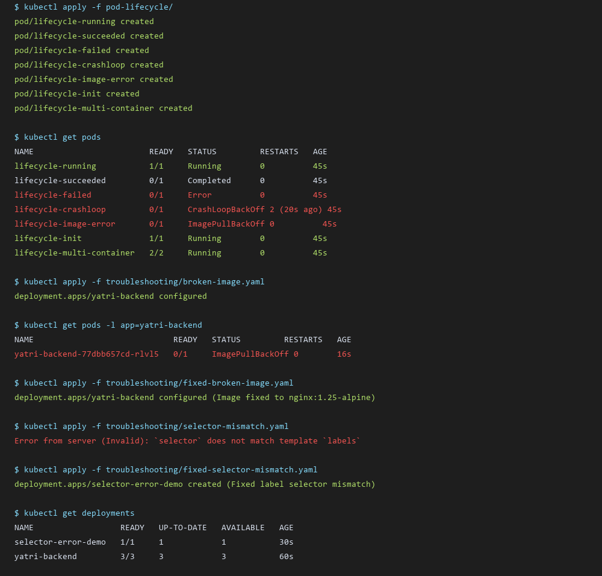

# Session 11: Kubernetes Networking, Pod Lifecycle & Troubleshooting Labs

> **Homework Submission**: Pod Lifecycle States & Troubleshooting Exercises

---

##  1. Deployment Rollout Execution

Deployment updates are managed declaratively using `kubectl apply`.
- **v1 Deployment**: Deploys `nginx:1.25-alpine` with 3 replicas.
- **v2 Deployment**: Updates image to `nginx:1.26-alpine` and container port definitions.

### Commands & Output
```bash
$ kubectl apply -f deployment/deployment-v1.yaml
deployment.apps/yatri-backend created

$ kubectl apply -f deployment/deployment-v2.yaml
deployment.apps/yatri-backend configured

$ kubectl rollout status deployment/yatri-backend
deployment "yatri-backend" successfully rolled out
```

---

## 2. Pod Lifecycle Hands-On Lab

Kubernetes Pods progress through a defined lifecycle lifecycle phase:

```text
  +-------------+       +---------------+       +---------------+
  |   Pending   | ----> |  Init Container| ----> |    Running    |
  +-------------+       +---------------+       +---------------+
         |                                              |
         v                                              v
  +-------------+                               +---------------+
  | ErrImagePull|                               |   Succeeded / |
  | (BackOff)   |                               |     Failed    |
  +-------------+                               +---------------+
```

### Pod States Summary Table

| Pod Name | Observed Status | Description & Cause |
| :--- | :--- | :--- |
| `lifecycle-running` | `Running` | Pod is active, passed probes, container is executing normally. |
| `lifecycle-succeeded` | `Completed` | Ephemeral container ran command (`echo "Done"`) and exited with code `0`. |
| `lifecycle-failed` | `Error` | Container exited with a non-zero exit code (`exit 1`). |
| `lifecycle-crashloop` | `CrashLoopBackOff` | Container continuously crashes and Kubernetes backs off restart interval. |
| `lifecycle-image-error` | `ImagePullBackOff` | Kubelet cannot fetch image tag from registry (`invalid-tag-xyz`). |
| `lifecycle-init` | `1/1 Running` | Init-container completed initial setup task before main container started. |
| `lifecycle-multi-container` | `2/2 Running` | Sidecar pattern: main app container and helper logger running in parallel. |
| `lifecycle-readiness` | `1/1 Running` | Pod readiness probe succeeded; added to service endpoint list. |
| `lifecycle-liveness` | `1/1 Running` | Health check probe periodically validates container responsiveness. |

---

## 3. Troubleshooting Exercises & Bug Fixes

### Exercise 1: Rollout Failure (`broken-image.yaml`)

- **Diagnosis**:
  Deploying `broken-image.yaml` resulted in surge pod failure with `ErrImagePull` / `ImagePullBackOff` due to non-existent image tag `yatri-backend:non-existent-tag-v999`.
- **Diagnostic Command**:
  ```bash
  $ kubectl describe pod yatri-backend-77dbb657cd-rlvl5
  # Event Log: Failed to pull image "yatri-backend:non-existent-tag-v999": rpc error: code = NotFound
  ```
- **Fix Applied**:
  Updated container image in `troubleshooting/fixed-broken-image.yaml` to valid registry image `nginx:1.25-alpine`.
- **Verification**:
  ```bash
  $ kubectl apply -f troubleshooting/fixed-broken-image.yaml
  deployment.apps/yatri-backend configured
  # All 3 replicas transitioned to 1/1 Running.
  ```

---

### Exercise 2: Label Selector Mismatch (`selector-mismatch.yaml`)

- **Diagnosis**:
  Applying `selector-mismatch.yaml` failed immediately at `kube-apiserver` validation:
  ```text
  The Deployment "selector-error-demo" is invalid: spec.template.metadata.labels: 
  Invalid value: {"app":"wrong-app-name"}: `selector` does not match template `labels`
  ```
  - `spec.selector.matchLabels` had `app: correct-app-name`
  - `spec.template.metadata.labels` had `app: wrong-app-name`
- **Fix Applied**:
  Updated `spec.template.metadata.labels.app` in `troubleshooting/fixed-selector-mismatch.yaml` to match `correct-app-name`.
- **Verification**:
  ```bash
  $ kubectl apply -f troubleshooting/fixed-selector-mismatch.yaml
  deployment.apps/selector-error-demo created
  ```

---

##  4. Terminal Output Screenshot


