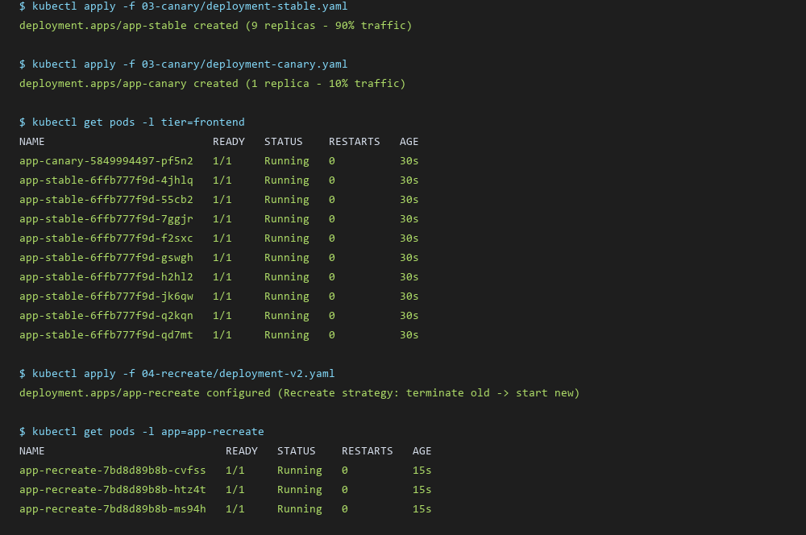
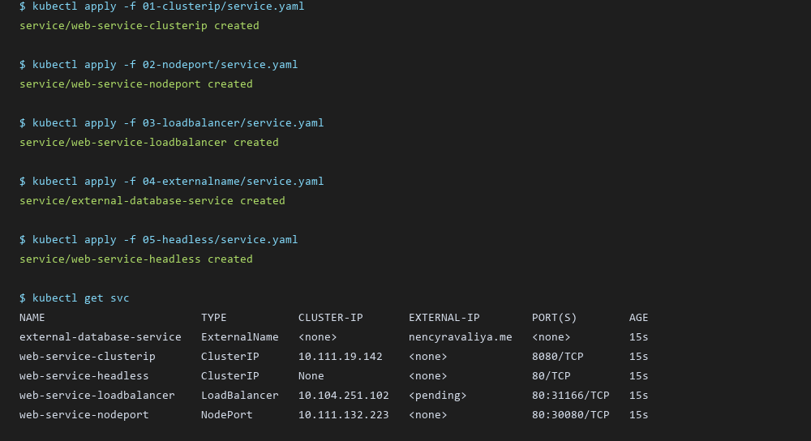
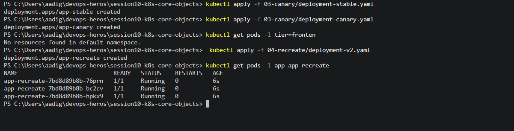
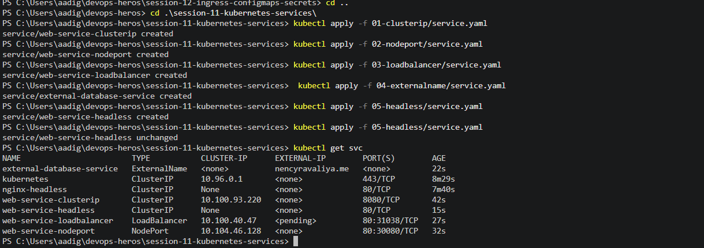

# Session 12: Kubernetes Ingress, Services, Deployment Strategies & CoreDNS

> **Homework Submission**: 5 Ingress, Service, Deployment Strategy & DNS Tasks

---

## 1. StatefulSet vs. Deployment vs. DaemonSet

| Feature | StatefulSet | Deployment | DaemonSet |
| :--- | :--- | :--- | :--- |
| **Use Case** | Stateful applications (Databases, Caches, MQ) | Stateless web apps, REST APIs | Node-level daemons (Loggers, Monitors, CNI) |
| **Pod Identity** | Unique, sticky ordinal index (`web-0`, `web-1`) | Random hash suffix (`app-7554bd5c75-4cqnk`) | Node name / host network binding |
| **Storage Binding** | Dedicated PVC per pod index (`volumeClaimTemplates`) | Shared PVC or ephemeral volume | HostPath or node local storage |
| **Scaling Order** | Ordered & Graceful (`0 -> 1 -> 2`) | Parallel scaling | Automatic scaling based on cluster Node count |
| **Network Address** | Stable FQDN DNS record | Ephemeral Pod IP | Node IP / HostPort |

---

## 2. ReplicaSet vs. Deployment

- **ReplicaSet**: Low-level workload controller whose sole responsibility is keeping a fixed number of identical pod replicas running at any given time using label selectors.
- **Deployment**: High-level declarative abstraction that manages ReplicaSets underneath.
  - Deployments handle **zero-downtime rolling updates**, **rollbacks**, **pause/resume operations**, and maintain **revision history** (`kubectl rollout history`).
  - Directly modifying a ReplicaSet image does not update existing pods, whereas modifying a Deployment automatically creates a new ReplicaSet and manages traffic transition.

---

## 3. Deployment Strategies Deep-Dive & Hands-on

```text
1. ROLLING UPDATE (Default)           2. RECREATE
   V1: [Pod1][Pod2][Pod3]                V1: [Pod1][Pod2][Pod3] -> TERMINATED
   V2: [Pod1][Pod2] + [PodNew]           V2: [PodNew1][PodNew2][PodNew3] -> STARTED
   (Zero Downtime)                       (Brief Downtime)

3. BLUE-GREEN                         4. CANARY
   Blue:  [V1 Pods] <--- Svc (Active)     Stable: [V1 Pods (90%)] <--- Svc
   Green: [V2 Pods]                       Canary: [V2 Pod  (10%)] <--- Svc
```

### Hands-On Execution Results

1. **Canary Deployment (`03-canary`)**:
   - Deployed `deployment-stable.yaml` (9 replicas) and `deployment-canary.yaml` (1 replica) matching service selector `app: my-app`.
   - Incoming traffic to `myapp-canary-service` is load-balanced 90% to stable and 10% to canary.
2. **Recreate Deployment (`04-recreate`)**:
   - Configured `spec.strategy.type: Recreate`.
   - Updating version from `v1` to `v2` immediately terminates all `v1` pods before starting `v2` pods, ensuring no old and new code versions run concurrently.

### Terminal Output Screenshot (Canary & Recreate)


---

## 4. Hands-On Guide to 5 Kubernetes Service Types

All 5 Kubernetes service types were deployed and verified on Minikube:

```bash
$ kubectl apply -f 01-clusterip/service.yaml
service/web-service-clusterip created

$ kubectl apply -f 02-nodeport/service.yaml
service/web-service-nodeport created

$ kubectl apply -f 03-loadbalancer/service.yaml
service/web-service-loadbalancer created

$ kubectl apply -f 04-externalname/service.yaml
service/external-database-service created

$ kubectl apply -f 05-headless/service.yaml
service/web-service-headless created
```

### Service Types Summary Table

| Service Type | IP Allocation | Accessibility | Use Case |
| :--- | :--- | :--- | :--- |
| **ClusterIP** | Virtual Internal Cluster IP | Inside cluster only | Internal microservice communication |
| **NodePort** | Cluster IP + Host Node Port (30000-32767) | NodeIP:NodePort | External access without cloud load balancer |
| **LoadBalancer** | Cluster IP + Cloud LB External IP | Public Internet | Production cloud applications (AWS ELB, GCP LB) |
| **ExternalName** | None (DNS CNAME redirect) | External domain target | Pointing K8s apps to external databases (`db.example.com`) |
| **Headless** | `clusterIP: None` (Direct Pod IPs) | Internal DNS resolution | StatefulSets & custom client load balancing |

### Terminal Output Screenshot (Service Types)


---

## 5. FQDN (Fully Qualified Domain Name) & CoreDNS Guide

### What is FQDN in Kubernetes?
A **Fully Qualified Domain Name (FQDN)** is an absolute domain name that specifies the exact location of a Service or Pod within the Kubernetes CoreDNS hierarchy.

### FQDN Format Structure

1. **Service FQDN**:
   ```text
   <service-name>.<namespace>.svc.cluster.local
   ```
   - Example: `web-service-clusterip.default.svc.cluster.local`
   - Short Name inside same namespace: `web-service-clusterip`
   - Short Name across namespaces: `web-service-clusterip.prod`

2. **Pod FQDN (StatefulSet)**:
   ```text
   <pod-name>.<headless-service-name>.<namespace>.svc.cluster.local
   ```
   - Example: `web-sts-0.nginx-headless.default.svc.cluster.local`

3. **Standard Pod FQDN**:
   ```text
   <pod-ip-with-dashes>.<namespace>.pod.cluster.local
   ```
   - Example: `172-17-0-5.default.pod.cluster.local`

### CoreDNS Architecture & Resolution Pipeline

1. **CoreDNS Deployment**: Runs as a cluster-wide service in namespace `kube-system` (`service/kube-dns`).
2. **Kubelet `/etc/resolv.conf` Injection**:
   Every container created by Kubelet has `/etc/resolv.conf` automatically configured:
   ```text
   nameserver 10.96.0.10
   search default.svc.cluster.local svc.cluster.local cluster.local
   options ndots:5
   ```
3. **Lookup Flow**:
   When an application makes a DNS query for `backend`:
   - `ndots:5` forces CoreDNS to append domain search suffixes first (`backend.default.svc.cluster.local`).
   - CoreDNS resolves the name to the virtual ClusterIP (or Pod IPs for Headless services) using internal watch streams from `kube-apiserver`.



