# Session 14 Homework: Kubernetes Troubleshooting

All work was done on a local **minikube** cluster (Kubernetes v1.37.0, 1 node) from a Windows PowerShell terminal.
To keep the work separate from earlier sessions, everything ran in its own namespace, `session14`, which was deleted at the end (see [Cleanup](#cleanup)).

Each command and its output is captured in a terminal screenshot under [`screenshots/`](screenshots/), and the plain-text transcript of every step is in [`outputs/`](outputs/).
Fixed and extra manifests written for this homework are in [`manifests/`](manifests/). The course's broken YAML files were not edited; every fix is a separate file, and the screenshots show the `git diff` between the broken and fixed versions.

## Contents

- [Setup](#setup)
- [Task 1: Kubernetes commands](#task-1-kubernetes-commands)
- [Task 2: Troubleshoot common issues](#task-2-troubleshoot-common-issues)
- [Task 3: Mini project](#task-3-mini-project)
- [Cleanup](#cleanup)

## Setup

```powershell
kubectl apply -f manifests\namespace.yaml
kubectl config set-context --current --namespace=session14
kubectl config view --minify --output=jsonpath='{..namespace}'
kubectl get namespace session14
kubectl cluster-info
```

**00-setup/01-namespace**

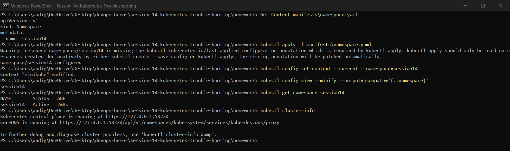


## Task 1: Kubernetes commands

| Command | Question it answers | What I used it for |
| :--- | :--- | :--- |
| `kubectl get` | What is happening? | Status, READY and RESTARTS of Pods, Services, Deployments and Nodes; `-w` to watch changes live |
| `kubectl get -o wide` | Where is it running? | Pod IP and node, node OS/runtime, Service selectors |
| `kubectl describe` | Why is it happening? | Container state, last state, exit codes, conditions and the Events section |
| `kubectl logs` | What is the application saying? | stdout/stderr, `--previous` for crashed containers, `--tail`, `--since`, `--timestamps`, `-f` |
| `kubectl exec` | What does it look like from inside? | `hostname`, files, `/etc/hosts`, `nginx -t`, `curl localhost` |
| `kubectl events` / `get events` | What did Kubernetes try? | Scheduling, pulling, mount and back-off events; filtered with `--for` and `--types=Warning` |
| `kubectl explain` | What does this field mean? | API docs for `restartPolicy`, `imagePullPolicy`, `service.spec.selector` |
| `kubectl top` | How much CPU/memory? | Node and Pod usage from metrics-server, `--containers`, `--sort-by=memory` |

Note: the screenshots run `kubectl exec` without `-it`, for example `kubectl exec exec-demo -- ls /usr/share/nginx/html`, so that every command and its output fits in one capture. `kubectl exec -it exec-demo -- bash` opens the same container interactively. `kubectl get pods -w` and `kubectl logs -f` were run as background jobs so the watch could be stopped and its output shown.

### kubectl get

```powershell
kubectl apply -f pod.yaml
kubectl get pods
kubectl get pods -o wide
kubectl get nodes
kubectl get services
kubectl get deployments
kubectl get all
kubectl get pods --show-labels
kubectl get pod get-demo -o custom-columns=NAME:.metadata.name,IP:.status.podIP,NODE:.spec.nodeName,IMAGE:.spec.containers[0].image
kubectl get pods -w        # then: kubectl delete pod get-demo
```

**task1/01-kubectl-get**

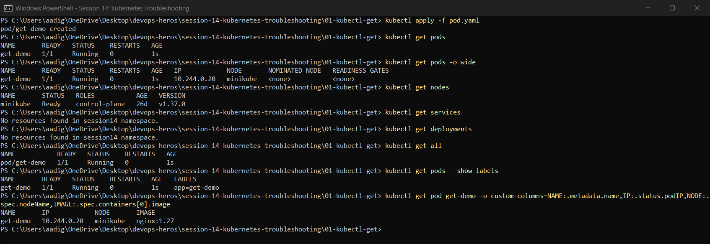

**task1/02-kubectl-get-watch**

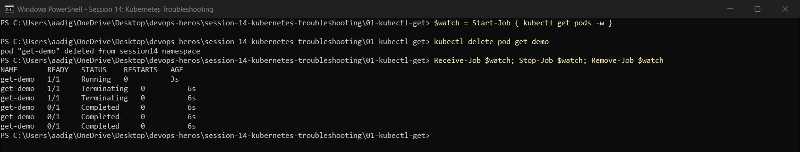


### kubectl describe

```powershell
kubectl describe pod describe-demo
kubectl describe service kubernetes -n default
kubectl describe node minikube
```

**task1/03-kubectl-describe-part1**

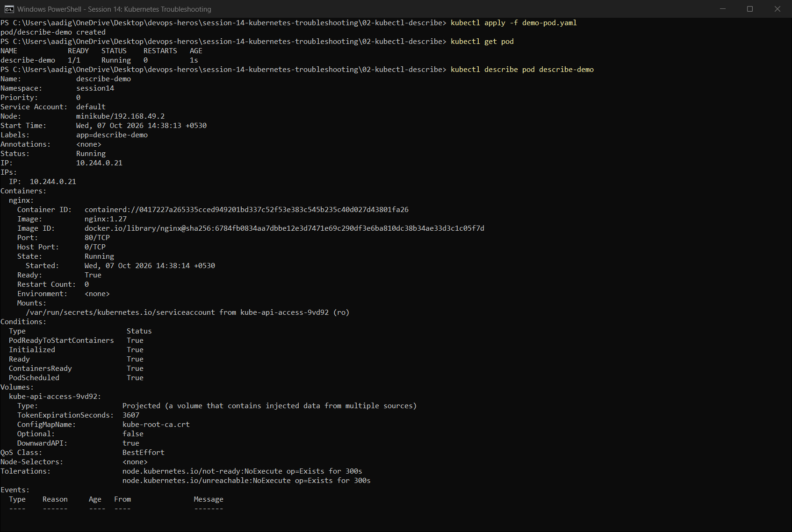

**task1/03-kubectl-describe-part2**

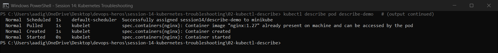

**task1/04-kubectl-describe-other**

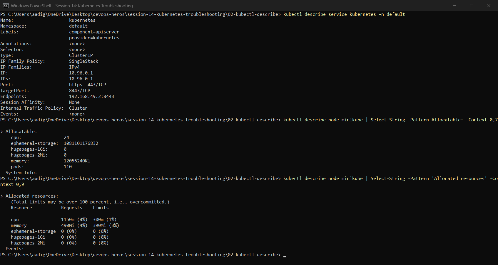


### kubectl logs

```powershell
kubectl logs logs-demo
kubectl logs logs-demo --tail=2 --timestamps
kubectl logs logs-demo -c app --since=10s
kubectl logs -f logs-demo --tail=1
```

**task1/05-kubectl-logs**

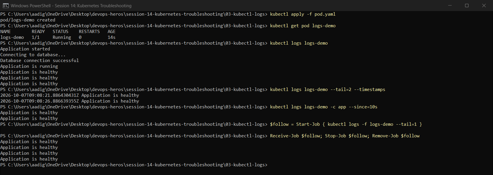


### kubectl exec

```powershell
kubectl exec exec-demo -- hostname
kubectl exec exec-demo -- ls /usr/share/nginx/html
kubectl exec exec-demo -- cat /etc/hosts
kubectl exec exec-demo -- nginx -t
kubectl exec exec-demo -- curl -s localhost
```

**task1/06-kubectl-exec**

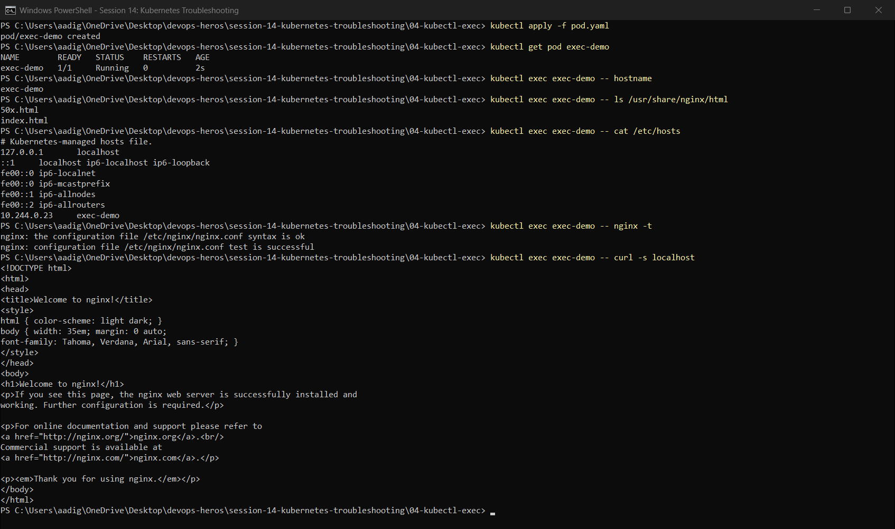


### kubectl events

```powershell
kubectl get events --sort-by=.lastTimestamp
kubectl events --for pod/events-demo
kubectl events --types=Warning
```

**task1/07-kubectl-events-part1**

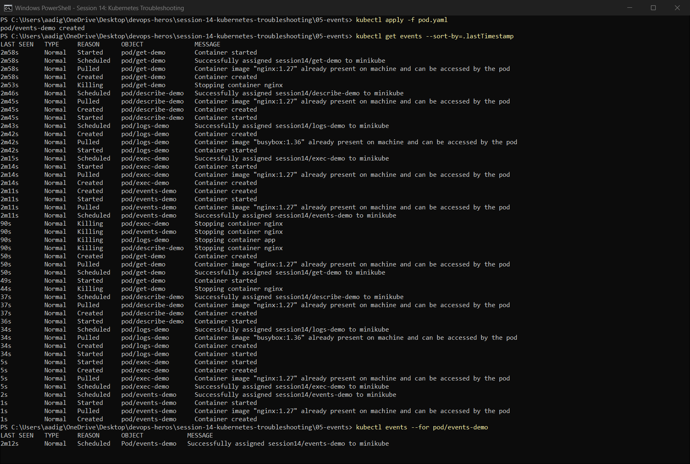

**task1/07-kubectl-events-part2**

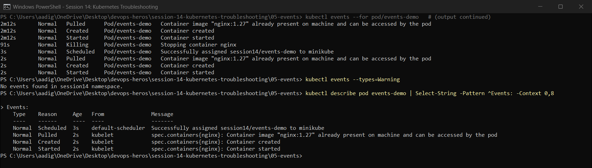


### kubectl explain

```powershell
kubectl explain pod.spec.restartPolicy
kubectl explain pod.spec.containers.imagePullPolicy
kubectl explain service.spec.selector
```

**task1/08-kubectl-explain-part1**

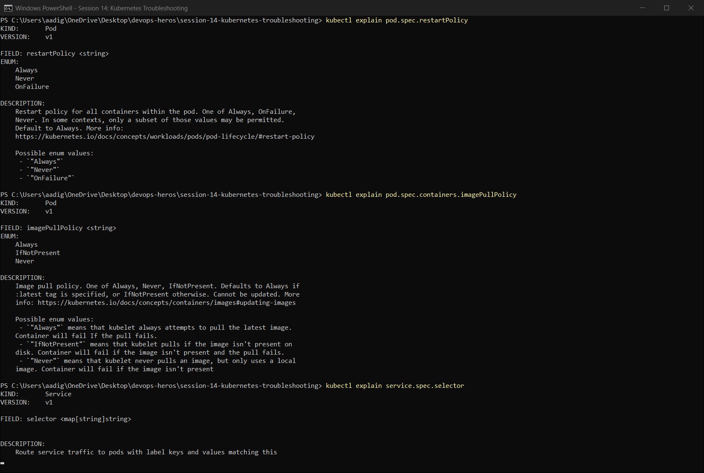

**task1/08-kubectl-explain-part2**

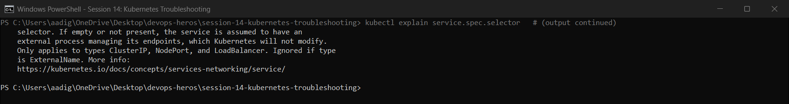


### kubectl top

```powershell
kubectl top nodes
kubectl top pods
kubectl top pod logs-demo --containers
kubectl top pods -A --sort-by=memory
```

**task1/09-kubectl-top**

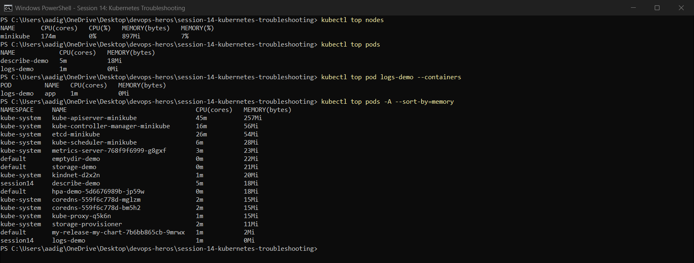


### kubectl get -o wide

```powershell
kubectl get pods -o wide
kubectl get nodes -o wide
kubectl get services -o wide -A
```

**task1/10-kubectl-get-o-wide**

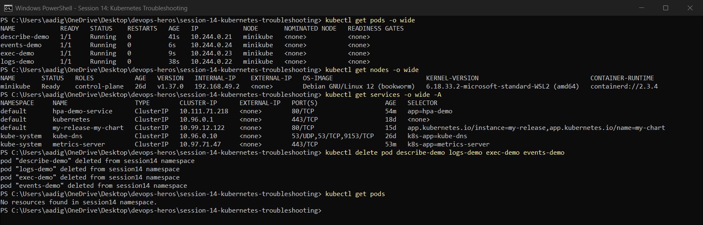


## Task 2: Troubleshoot common issues

Every issue follows the same six steps: **identify → investigate → root cause → fix → verify → document**.

### Summary

| # | Issue | What I saw | Command that found it | Root cause | Fix |
| :--- | :--- | :--- | :--- | :--- | :--- |
| 1 | CrashLoopBackOff (`crash-demo`) | `0/1 CrashLoopBackOff`, restarts climbing | `kubectl logs --previous`, `describe` (Exit Code 1) | Container command ends with `exit 1` | Command that keeps running (`fixed-pod.yaml`) |
| 1b | CrashLoopBackOff (scenario 1) | `CrashLoopBackOff` | `kubectl logs --previous`: `[FATAL ERROR]: DATABASE_URL environment variable is MISSING!` | Required env var not set; the app also exits after starting | Add `DATABASE_URL` env and keep the process running |
| 2 | ErrImagePull → ImagePullBackOff (`image-demo`) | `ErrImagePull`, then `ImagePullBackOff` | `describe` / `kubectl events`: `code = NotFound`; `docker manifest inspect` → `no such manifest` | Image tag does not exist (`docker manifest inspect` confirms) | Use `nginx:1.27` |
| 2b | ImagePullBackOff (scenario 2) | `ErrImagePull` / `ImagePullBackOff` | `kubectl events`: `failed to pull and unpack image docker.io/library/yatri-api-service:...` | Image `yatri-api-service` is not in any registry the cluster can reach | Use an existing image (`nginx:1.27`) |
| 3 | Pending (`pending-demo`) | `Pending`, NODE `<none>` | `describe` → `FailedScheduling ... didn't match Pod's node affinity/selector` | `nodeSelector: kubernetes.io/hostname=node-that-does-not-exist` | Remove the nodeSelector |
| 3b | Pending (scenario 3) | `Pending` | `kubectl events`: `Insufficient cpu, Insufficient memory` | Requests of 500 CPU / 1000Gi on a 24 CPU / ~11.5Gi node | Requests 100m / 64Mi, limits 250m / 128Mi |
| 4 | ContainerCreating (`cc-demo`) | Stuck in `ContainerCreating` | `describe` → `FailedMount: configmap "web-content" not found` | Pod mounts a ConfigMap that does not exist | Create the ConfigMap; kubelet retries the mount and the Pod starts without being recreated |
| 5 | Configuration (`config-demo`) | `CreateContainerConfigError` | `describe` → `couldn't find key LOG_LEVEL in ConfigMap session14/app-settings` | Env var references key `LOG_LEVEL`; the ConfigMap key is `log_level` | Reference the correct key |
| 6 | Service connectivity (`web-service`) | `wget http://web-service`: Connection refused | `describe service` → `Endpoints:` empty; `get pods -l app=web-ahsgdf` → none | Service selector `app: web-ahsgdf` matches no Pod (Pods are `app: web`) | Selector `app: web` |
| 6b | Service connectivity (`web-wrong-port`) | Endpoints exist, but connection refused | `describe service` → `TargetPort 8080`; `curl localhost:8080` in the Pod fails | targetPort 8080, nginx listens on 80 | `targetPort: 80` |
| 7 | DNS: course `dns-test` Pod | `ImagePullBackOff` | `kubectl events`: `registry.k8s.io/e2e-test-images/dnsutils:1.3: not found` | Image does not exist | `jessie-dnsutils:1.3` (image used in the official DNS debugging guide) |
| 7b | DNS (scenario 4) | App cannot reach its database | `curl`: `Could not resolve host`; `nslookup` → `NXDOMAIN` | Wrong hostname: no `postgres-db-wrong-name` Service and no `production` namespace | Use the real Service FQDN `web-service.session14.svc.cluster.local` |
| 8 | Pod networking (`net-server`) | `wget <pod-ip>:8080` from another Pod: connection refused | `exec ... netstat -tln` → listening on `127.0.0.1:8080` | Server binds to loopback only | Bind to `0.0.0.0` |
| 9 | OOMKilled (extra scenario 5) | `0/1 OOMKilled`, 4 restarts in 2 min | `describe` → `Reason: OOMKilled`, `Exit Code: 137`, `Limits: memory 20Mi` | App keeps ~1000 MB in a list with a 20Mi limit | Process chunks one at a time; limit 64Mi |

Full write-ups per issue follow.

### 1. CrashLoopBackOff

**Problem.** `crash-demo` goes `Error` → `CrashLoopBackOff`, and its restart count keeps climbing.

**Investigation.**
```powershell
kubectl get pod crash-demo
kubectl describe pod crash-demo          # State: Waiting (CrashLoopBackOff), Last State: Terminated, Exit Code 1
kubectl logs crash-demo
kubectl logs crash-demo --previous        # Application starting... / Something went wrong!
kubectl get pod crash-demo -o jsonpath='exitCode={.status.containerStatuses[0].lastState.terminated.exitCode}'
```

**Root cause.** The container command prints its messages and then runs `exit 1`. The process exits with an error, and `restartPolicy: Always` restarts it again and again, with a growing back-off delay.

**Fix.** Delete the Pod and apply `fixed-pod.yaml`, whose command keeps running (`sleep 3600`).

**Verify.** `1/1 Running`, `Restart Count: 0`, and the logs show `Application is healthy`.

Scenario 1 (`fail-1-crashloop-pod`) gives the same symptom for a different reason. `kubectl logs --previous` shows `[FATAL ERROR]: DATABASE_URL environment variable is MISSING!`. The fix ([manifests/crashloop/scenario-1-fixed.yaml](manifests/crashloop/scenario-1-fixed.yaml)) adds the `DATABASE_URL` env var. It also keeps the process alive: even a successful program that exits would be restarted under `restartPolicy: Always` and end up in CrashLoopBackOff again.

**task2/01-crashloop/01-identify**

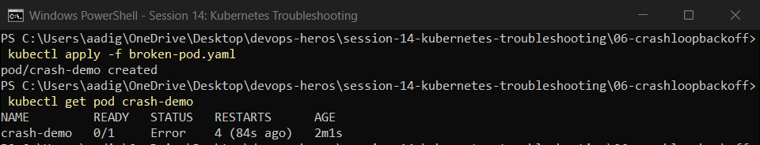

**task2/01-crashloop/02-investigate-part1**

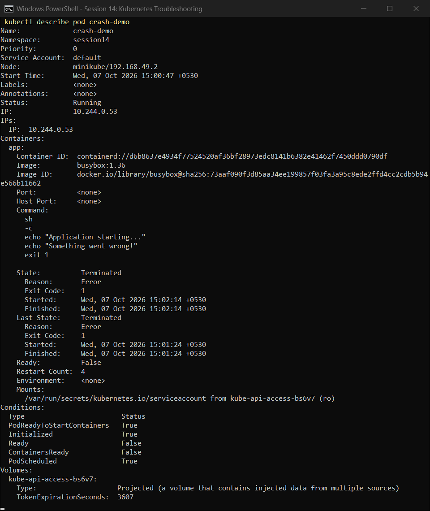

**task2/01-crashloop/02-investigate-part2**

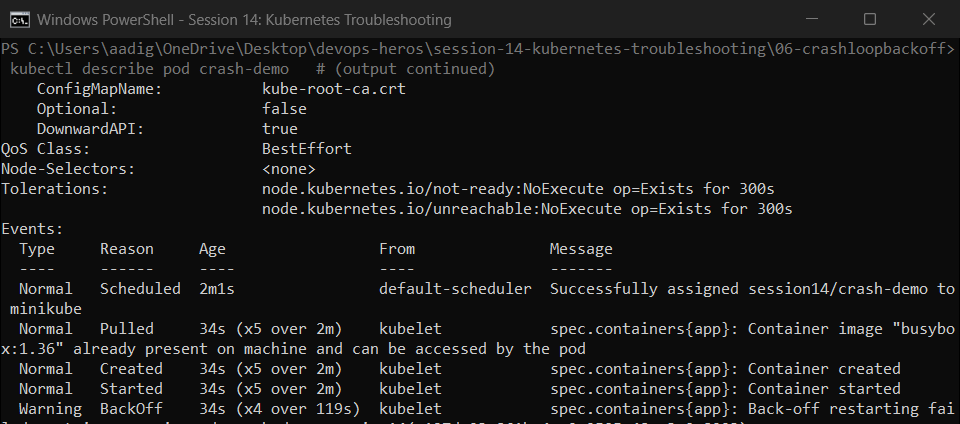

**task2/01-crashloop/03-root-cause**

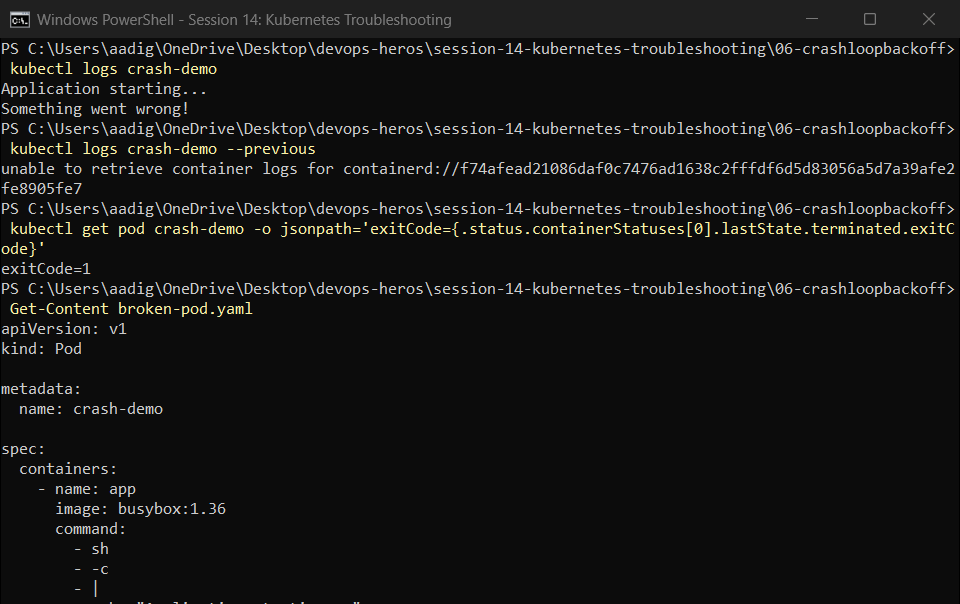

**task2/01-crashloop/04-fix**

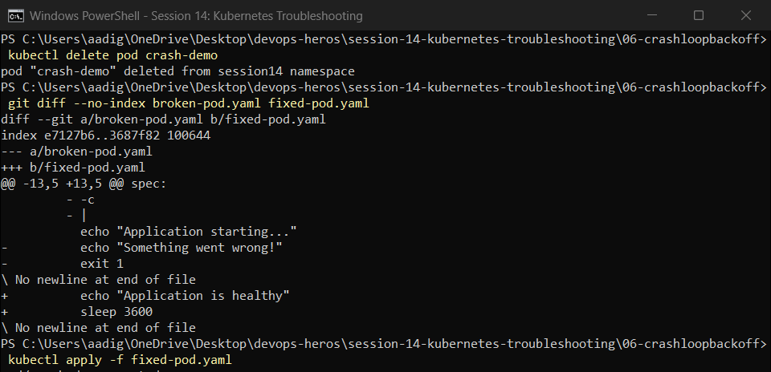

**task2/01-crashloop/05-verify**

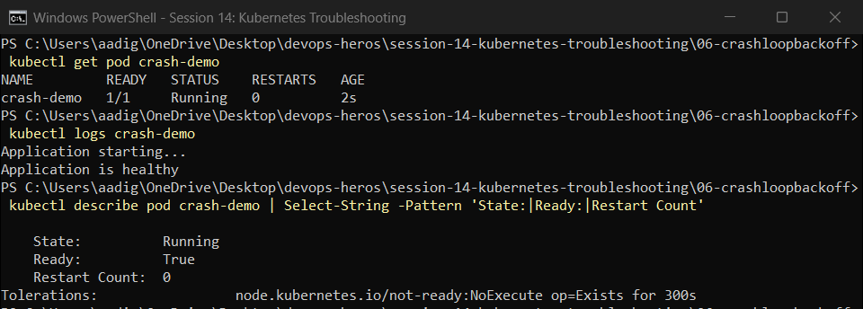

**task2/01-crashloop/06-scenario1-identify**

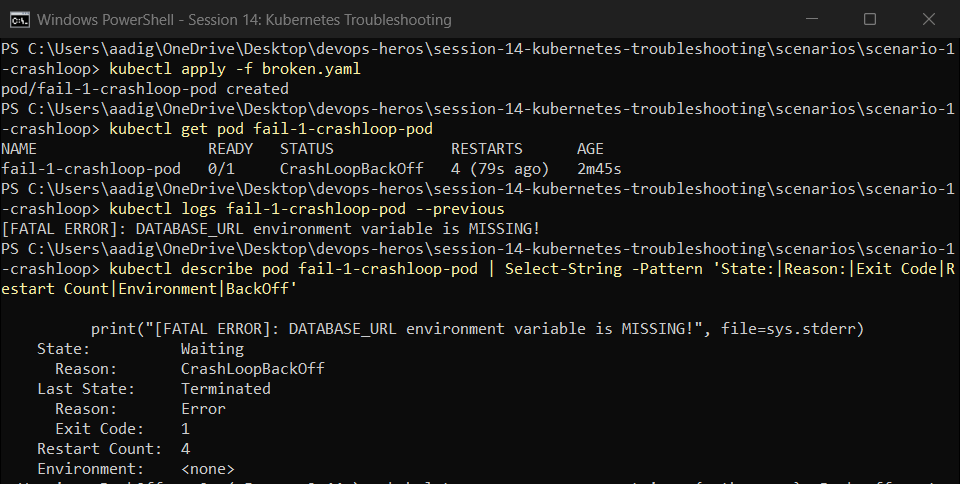

**task2/01-crashloop/07-scenario1-fix-verify**

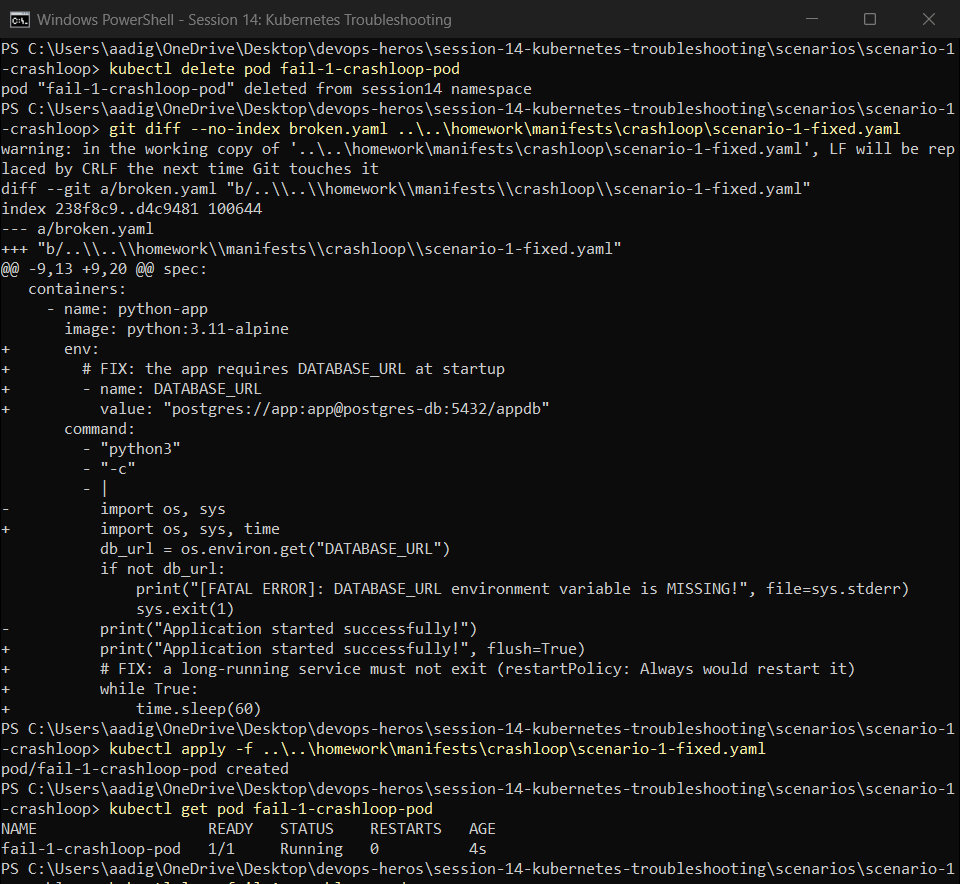


### 2. ErrImagePull / ImagePullBackOff

**Problem.** `image-demo` shows `ErrImagePull` first. After retries it shows `ImagePullBackOff`. The container never starts.

**Investigation.**
```powershell
kubectl get pod image-demo
kubectl describe pod image-demo           # Events: Failed to pull image "nginx:this-image-does-not-exist" ... not found
kubectl events --for pod/image-demo
docker manifest inspect nginx:this-image-does-not-exist   # no such manifest
docker manifest inspect nginx:1.27                        # exists
```

**Root cause.** The tag `this-image-does-not-exist` does not exist in Docker Hub. `ErrImagePull` is the failed pull attempt itself. `ImagePullBackOff` is kubelet waiting longer and longer between retries.

**Fix.** Use `image: nginx:1.27`.

**Verify.** `1/1 Running`, and the events show `Pulled` / `Started`.

Scenario 2 (`yatri-api-service:v999-invalid-tag-does-not-exist`) fails because the image resolves to `docker.io/library/yatri-api-service`, which does not exist, so I replaced it with a real image ([manifests/imagepull/scenario-2-fixed.yaml](manifests/imagepull/scenario-2-fixed.yaml)). For a real private repository, the fix would be an `imagePullSecret`.

**task2/02-imagepull/01-identify**

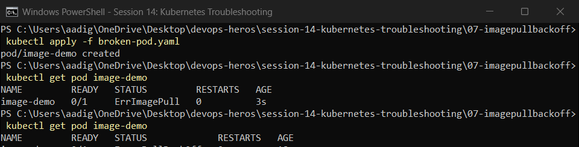

**task2/02-imagepull/02-investigate-part1**

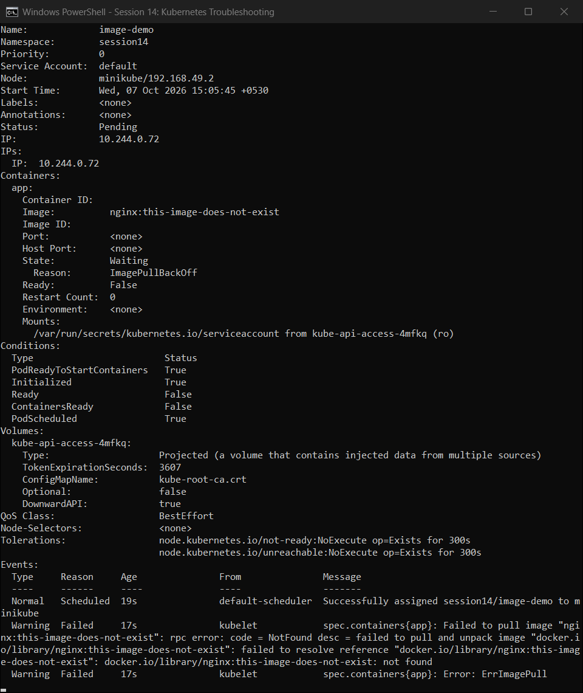

**task2/02-imagepull/02-investigate-part2**

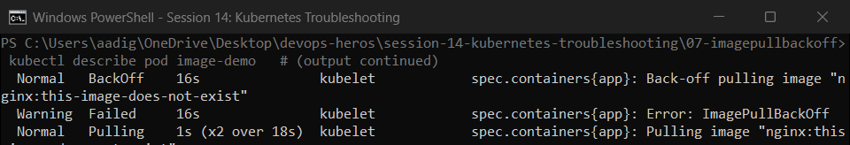

**task2/02-imagepull/03-root-cause**

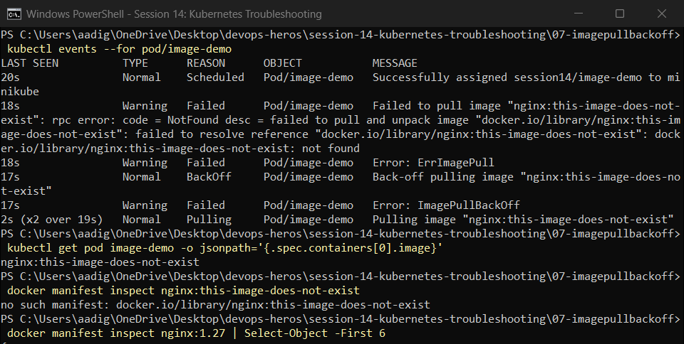

**task2/02-imagepull/04-fix-verify**

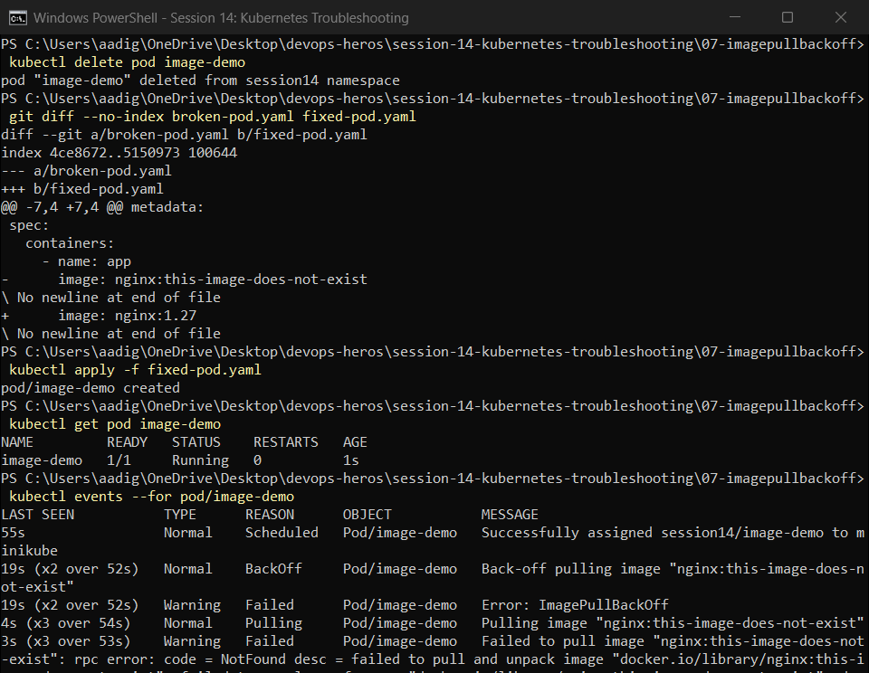

**task2/02-imagepull/05-scenario2-identify**

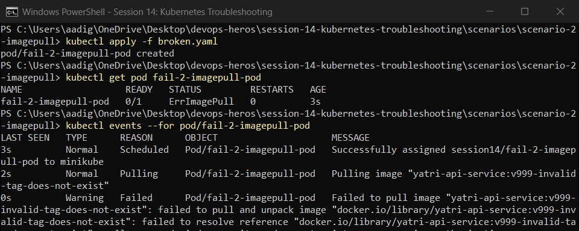

**task2/02-imagepull/06-scenario2-fix-verify**

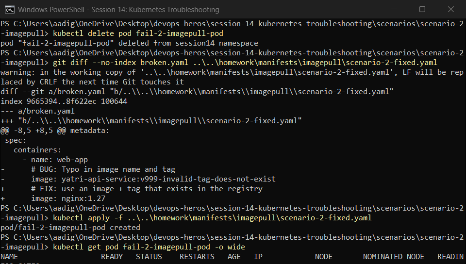


### 3. Pending

**Problem.** `pending-demo` stays `Pending` with `NODE <none>`.

**Investigation.**
```powershell
kubectl get pod pending-demo -o wide
kubectl describe pod pending-demo         # PodScheduled False; Warning FailedScheduling ... didn't match Pod's node affinity/selector
kubectl get pod pending-demo -o jsonpath='{.spec.nodeSelector}'
kubectl get nodes -L kubernetes.io/hostname
```

**Root cause.** The Pod has `nodeSelector: kubernetes.io/hostname: node-that-does-not-exist`. The only node is `minikube`, so the scheduler has nowhere to place the Pod.

**Fix.** Apply `fixed-pod.yaml` (no nodeSelector).

**Verify.** `Running` on node `minikube`.

Scenario 3 asks for `cpu: 500` and `memory: 1000Gi`. Node allocatable is 24 CPU and about 11.5Gi, so the event reads `Insufficient cpu, Insufficient memory`. The fix ([manifests/pending/scenario-3-fixed.yaml](manifests/pending/scenario-3-fixed.yaml)) requests 100m / 64Mi.

**task2/03-pending/01-identify**

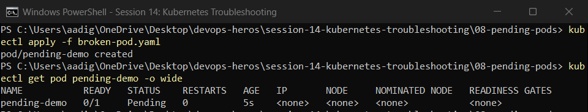

**task2/03-pending/02-investigate**

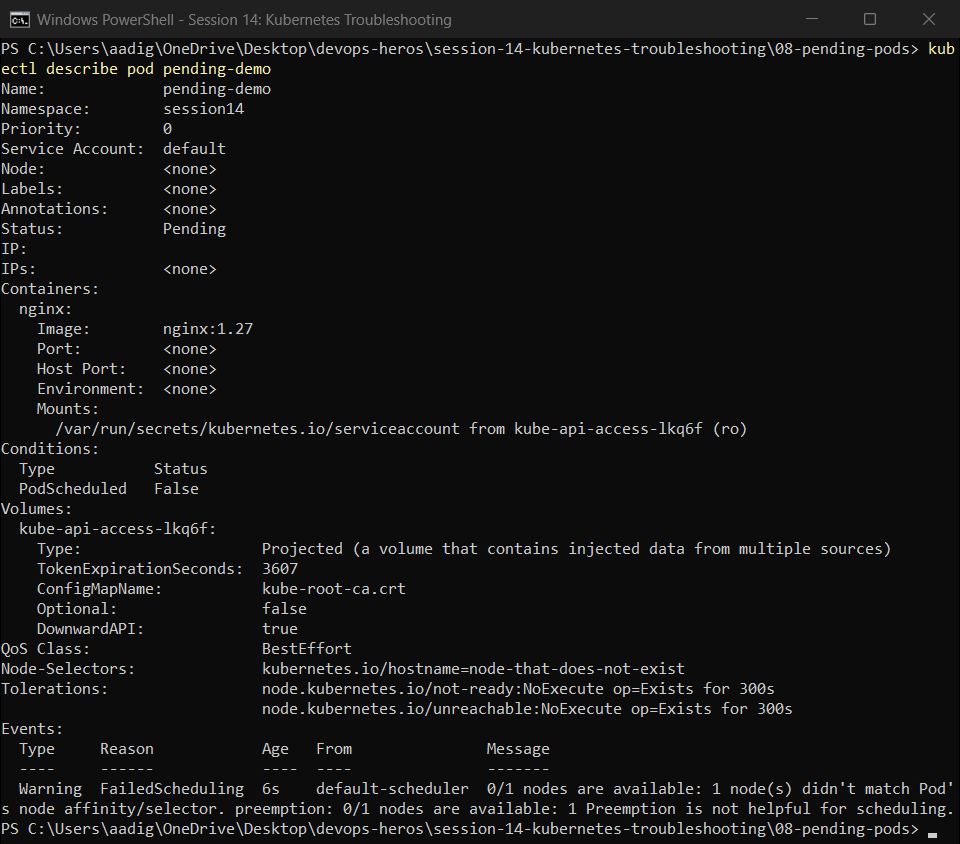

**task2/03-pending/03-root-cause**

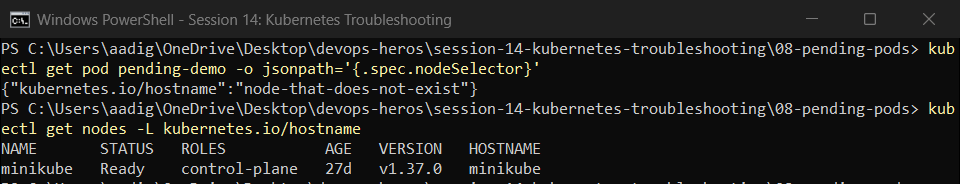

**task2/03-pending/04-fix-verify**

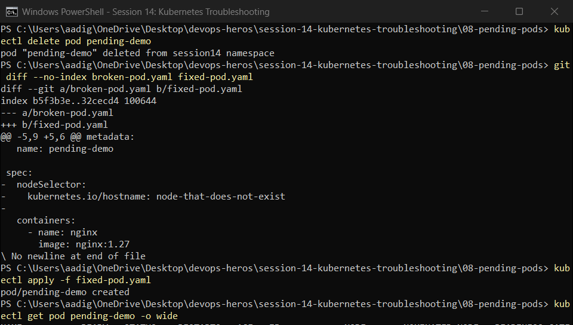

**task2/03-pending/05-scenario3-identify**

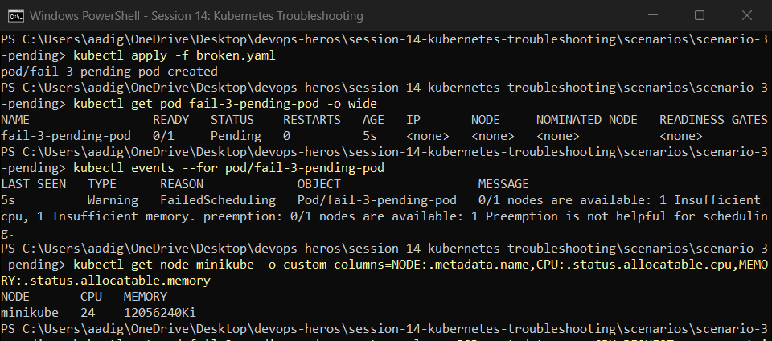

**task2/03-pending/06-scenario3-fix-verify**

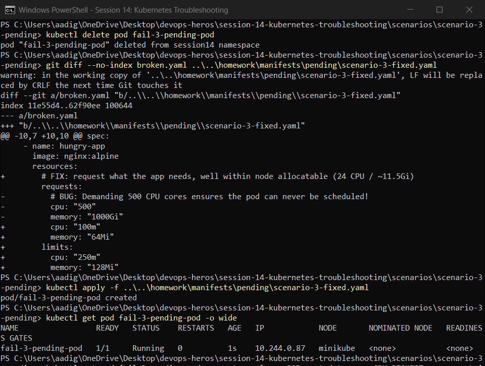


### 4. ContainerCreating

**Problem.** `cc-demo` stays in `ContainerCreating` and never becomes Running.

**Investigation.**
```powershell
kubectl get pod cc-demo
kubectl describe pod cc-demo              # Warning FailedMount: MountVolume.SetUp failed ... configmap "web-content" not found
kubectl events --for pod/cc-demo --types=Warning
kubectl get configmap web-content         # NotFound
```

**Root cause.** The Pod mounts ConfigMap `web-content` as its nginx html volume, but that ConfigMap was never created. Kubelet cannot set up the volume, so the container is never started.

**Fix.** `kubectl apply -f web-content-configmap.yaml`. The Pod does not need to be recreated, because kubelet retries the mount.

**Verify.** `1/1 Running`, and `curl localhost` inside the Pod returns `<h1>Session 14 - ContainerCreating fixed</h1>`.

Other common causes of a Pod stuck in ContainerCreating: a missing Secret, a PVC that is not bound, CNI or network setup failures, and slow image pulls.

**task2/04-containercreating/01-identify**

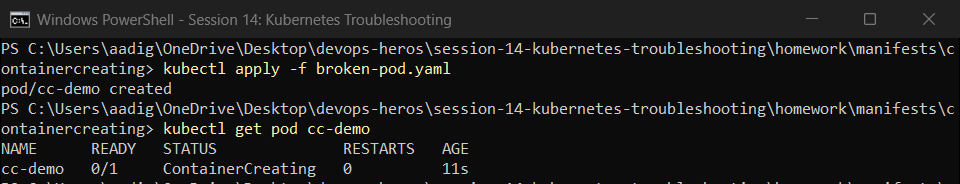

**task2/04-containercreating/02-investigate-part1**

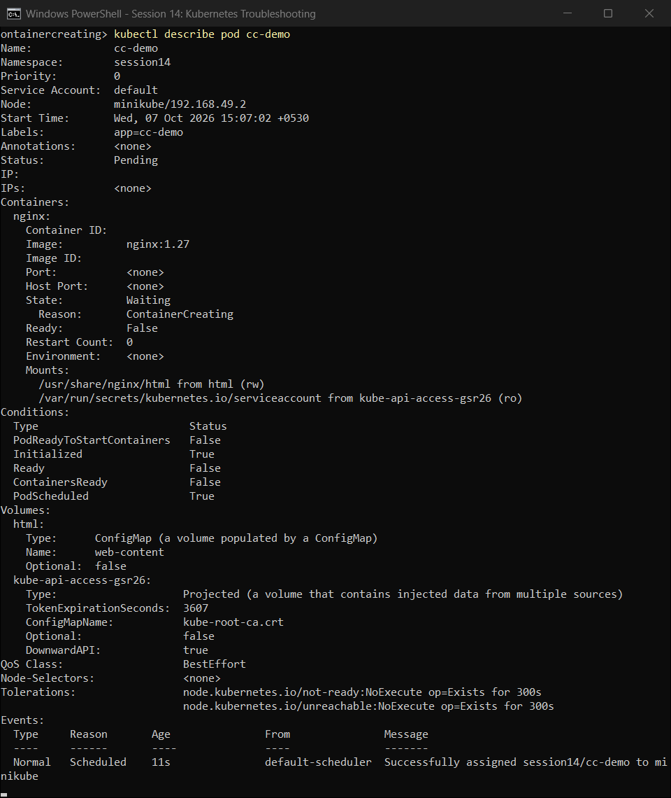

**task2/04-containercreating/02-investigate-part2**

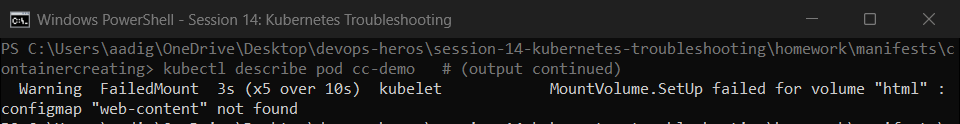

**task2/04-containercreating/03-root-cause**

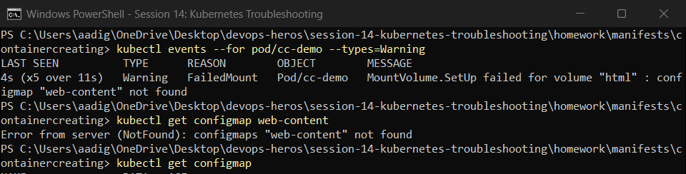

**task2/04-containercreating/04-fix-verify**

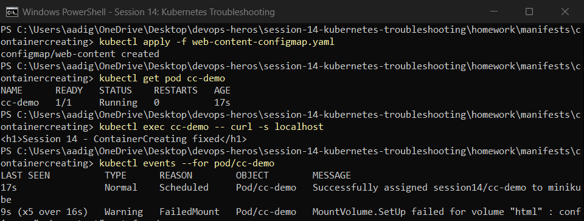


### 5. Configuration issue (CreateContainerConfigError)

**Problem.** `config-demo` shows `CreateContainerConfigError`.

**Investigation.**
```powershell
kubectl describe pod config-demo          # Error: couldn't find key LOG_LEVEL in ConfigMap session14/app-settings
kubectl events --for pod/config-demo --types=Warning
kubectl get configmap app-settings -o yaml   # keys are log_level and app_mode
```

**Root cause.** The env var uses `configMapKeyRef.key: LOG_LEVEL`, but the ConfigMap key is `log_level`. Keys are case-sensitive.

**Fix.** Recreate the Pod with `key: log_level` ([manifests/configuration/fixed-pod.yaml](manifests/configuration/fixed-pod.yaml)).

**Verify.** `Running`, and the logs show `LOG_LEVEL=info APP_MODE=production`.

**task2/05-configuration/01-identify**

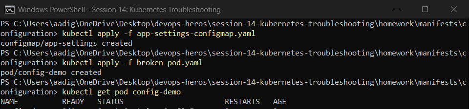

**task2/05-configuration/02-investigate-part1**

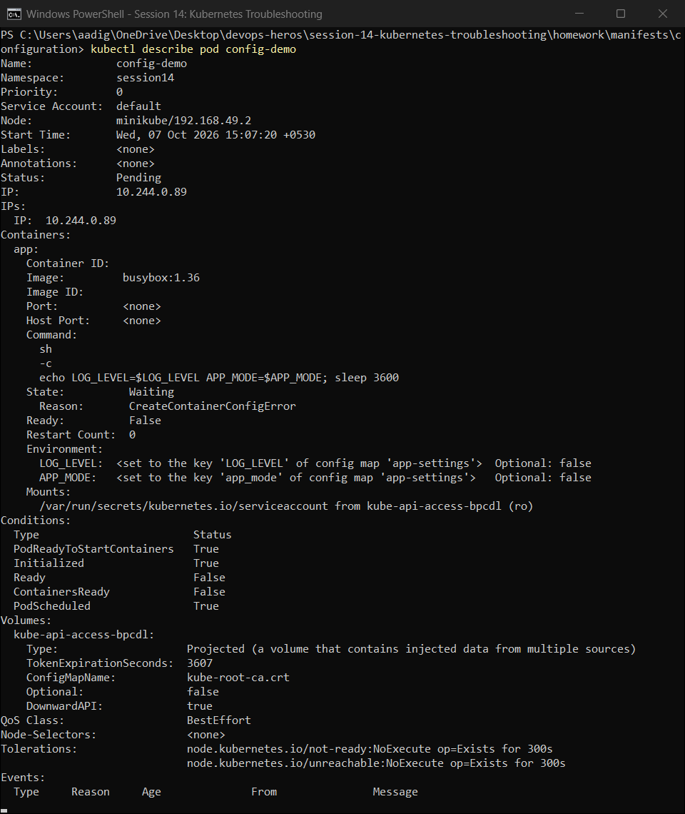

**task2/05-configuration/02-investigate-part2**

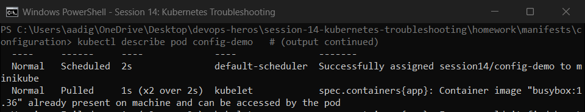

**task2/05-configuration/03-root-cause**

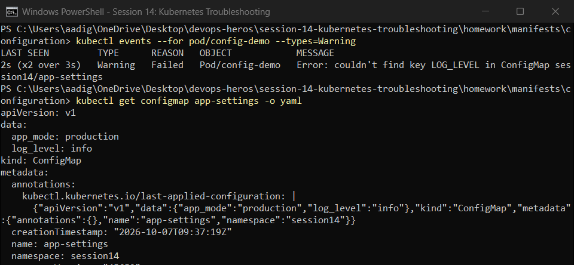

**task2/05-configuration/04-fix-verify**

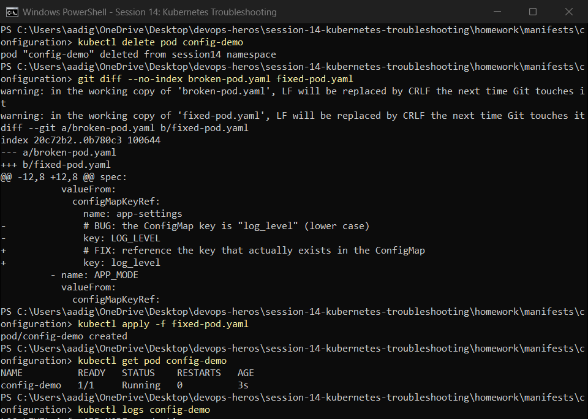


### 6. Service connectivity

**Problem.** The `web` Deployment (2 nginx Pods) is healthy, but `wget http://web-service` from another Pod fails with *Connection refused*.

**Investigation.**
```powershell
kubectl describe service web-service      # Selector: app=web-ahsgdf, Endpoints: (empty)
kubectl get endpoints web-service         # <none>
kubectl get pods --show-labels            # app=web
kubectl get service web-service -o jsonpath='{.spec.selector}'
kubectl get pods -l app=web-ahsgdf        # No resources found
```

**Root cause.** The course's `service.yaml` has the selector `app: web-ahsgdf`, which matches no Pod. A Service with no endpoints has nowhere to send traffic.

**Fix.** Selector `app: web` ([manifests/service/service-fixed.yaml](manifests/service/service-fixed.yaml)).

**Verify.** Endpoints list both Pod IPs on port 80, and `wget` returns the nginx welcome page.

I also reproduced the README's `broken-service` (selector `app: does-not-exist`, endpoints `<none>`) and a second type of Service fault, a wrong targetPort. `web-wrong-port` has endpoints (`<pod-ip>:8080`), but nginx listens on 80, so connections are refused. `curl localhost:80` inside the Pod works and `curl localhost:8080` fails, which confirms the cause. Setting `targetPort: 80` fixes it. Lesson: endpoints existing does not prove the port is right.

**task2/06-service/01-deploy**

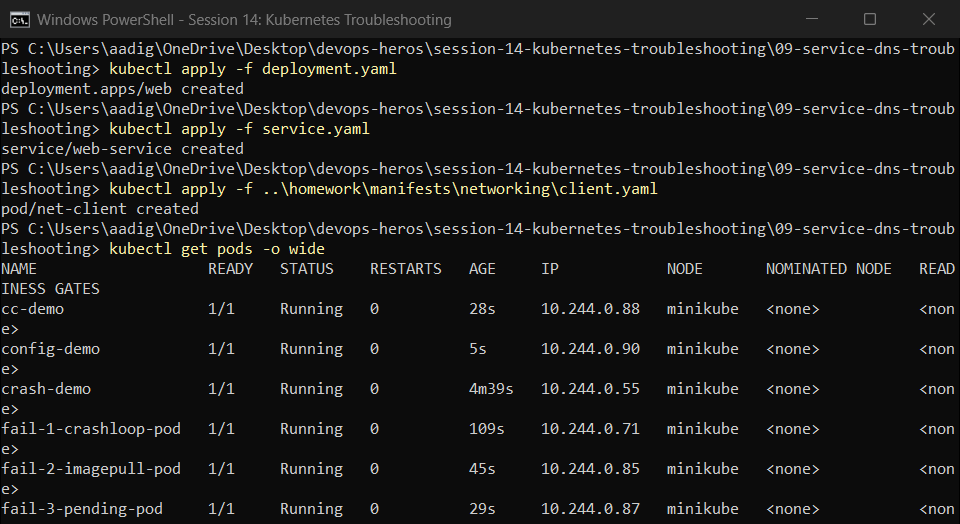

**task2/06-service/02-identify**

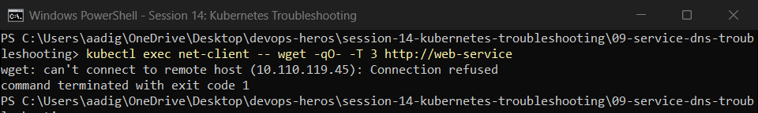

**task2/06-service/03-investigate**

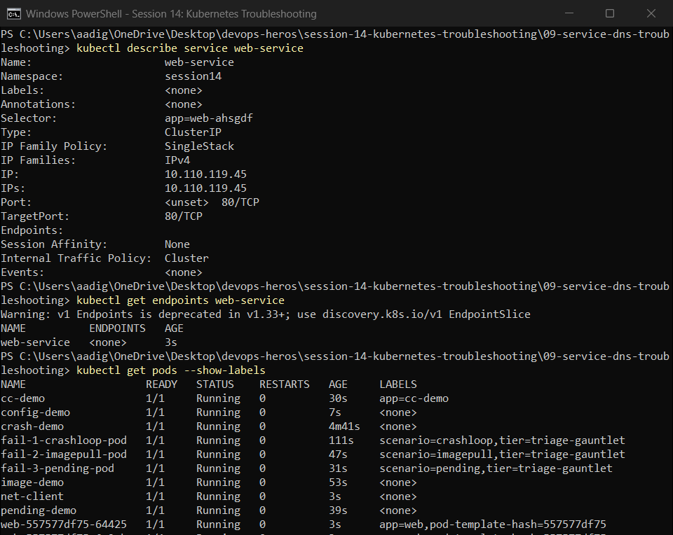

**task2/06-service/04-root-cause**

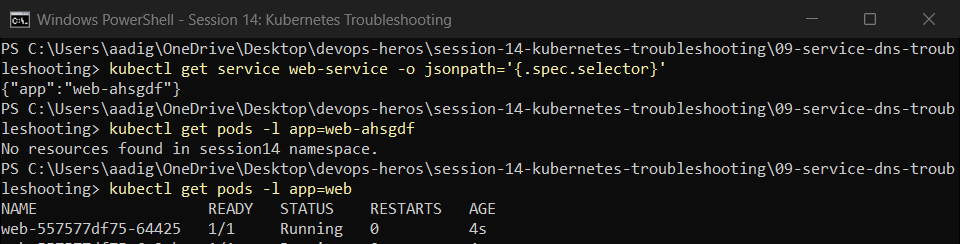

**task2/06-service/05-fix-verify-part1**

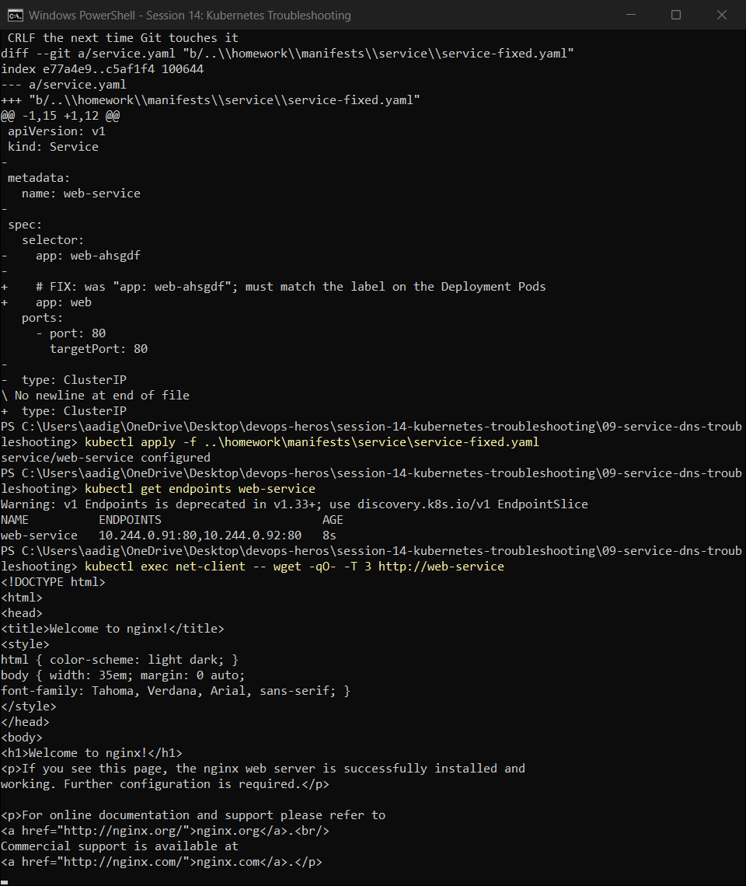

**task2/06-service/05-fix-verify-part2**

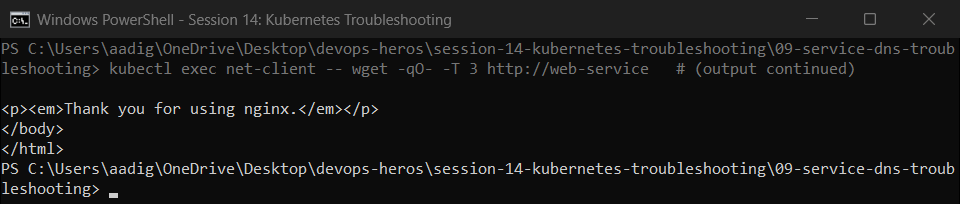

**task2/06-service/06-broken-service**

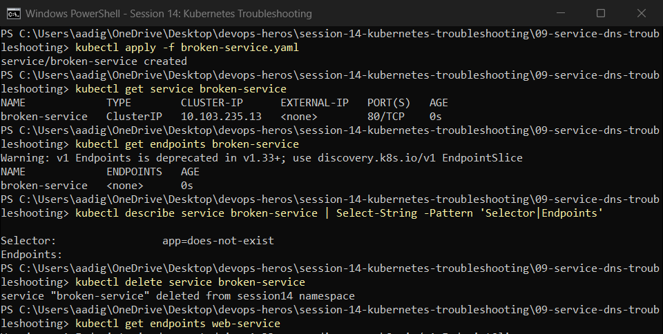

**task2/06-service/07-targetport-identify**

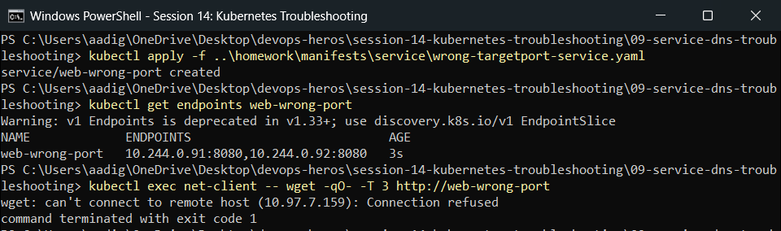

**task2/06-service/08-targetport-root-cause**

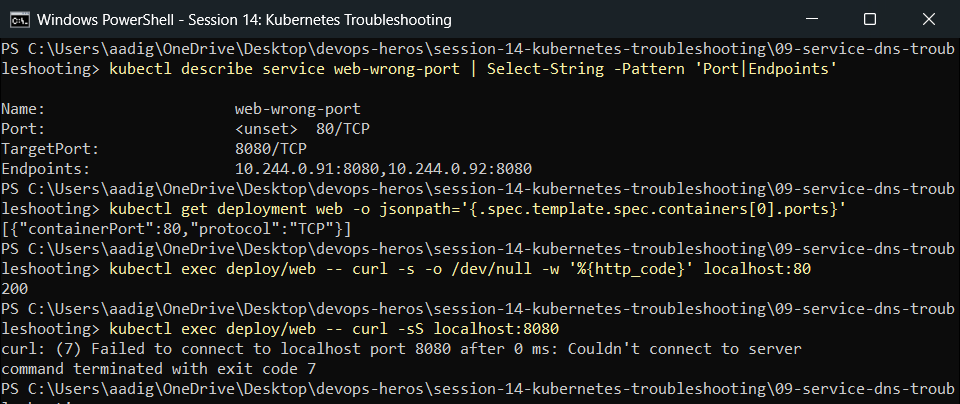

**task2/06-service/09-targetport-fix-verify**

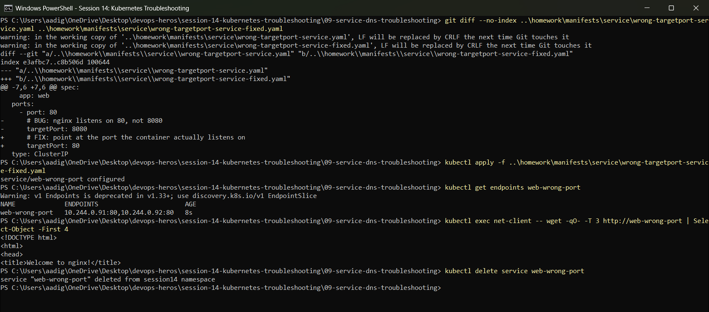


### 7. DNS

**Problem 1: the course's DNS test Pod does not start.** `dns-test-pod.yaml` goes to `ImagePullBackOff`. The event says `registry.k8s.io/e2e-test-images/dnsutils:1.3: not found`. That image does not exist; the official Kubernetes DNS debugging guide uses `registry.k8s.io/e2e-test-images/jessie-dnsutils:1.3`. The fixed Pod is [manifests/dns/dns-test-pod-fixed.yaml](manifests/dns/dns-test-pod-fixed.yaml). That image has `nslookup` and `dig` but no `wget` or `curl`, so HTTP tests in this homework run from a busybox Pod, `net-client`.

**Healthy DNS checks.**
```powershell
kubectl exec dns-test -- nslookup web-service
kubectl exec dns-test -- nslookup web-service.session14.svc.cluster.local
kubectl exec dns-test -- cat /etc/resolv.conf     # nameserver 10.96.0.10, search session14.svc.cluster.local ...
kubectl get pods -n kube-system -l k8s-app=kube-dns -o wide
kubectl get endpoints kube-dns -n kube-system
kubectl logs -n kube-system -l k8s-app=kube-dns --tail=8
```

**Problem 2 (scenario 4).** The client Pod runs, but it never reaches its database. Its `curl` uses `-s`, so the logs hide the error.

**Investigation.**
```powershell
kubectl exec fail-4-dns-failure-pod -- curl -sS --connect-timeout 3 http://postgres-db-wrong-name.production.svc.cluster.local:5432
#   curl: (6) Could not resolve host
kubectl exec dns-test -- nslookup postgres-db-wrong-name.production.svc.cluster.local   # NXDOMAIN
kubectl get namespace production          # NotFound
kubectl get services -A                   # no such Service
kubectl exec dns-test -- nslookup kubernetes.default   # resolves, so CoreDNS itself is healthy
```

**Root cause.** The hostname is wrong: no Service by that name exists and there is no `production` namespace. CoreDNS is fine, because other names resolve.

**Fix.** Point the client at a real Service FQDN, `web-service.session14.svc.cluster.local` ([manifests/dns/scenario-4-fixed.yaml](manifests/dns/scenario-4-fixed.yaml)).

**Verify.** The logs show `HTTP 200 from web-service`.

**task2/07-dns/01-dns-test-pod-identify**

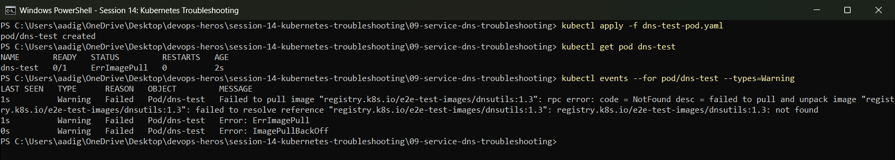

**task2/07-dns/02-dns-test-pod-fix**

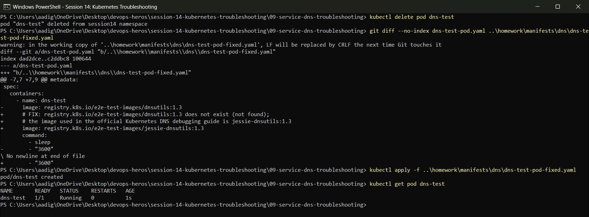

**task2/07-dns/03-dns-healthy-checks**

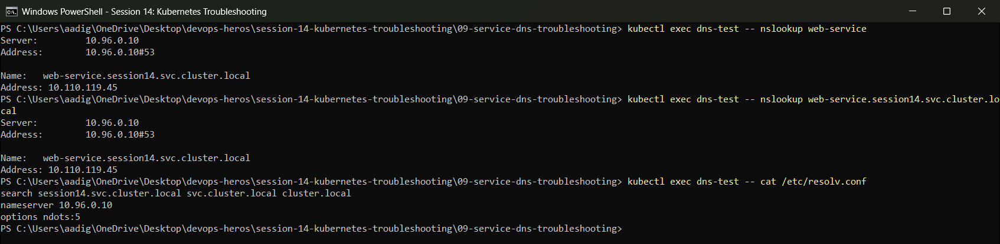

**task2/07-dns/04-coredns**

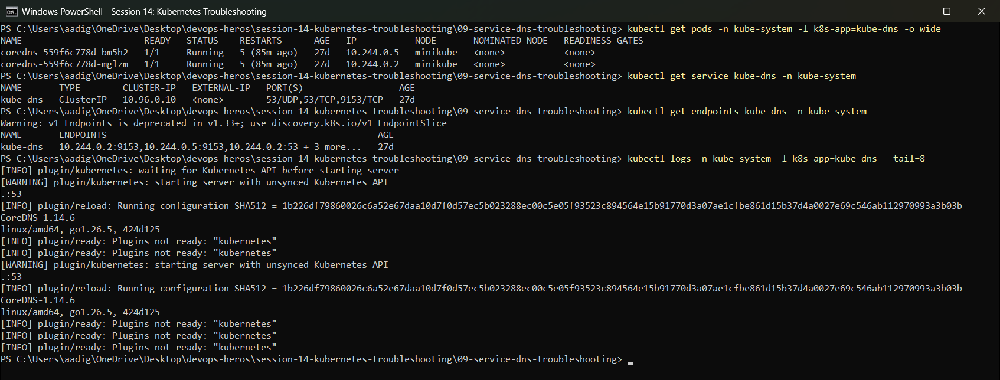

**task2/07-dns/05-scenario4-identify**

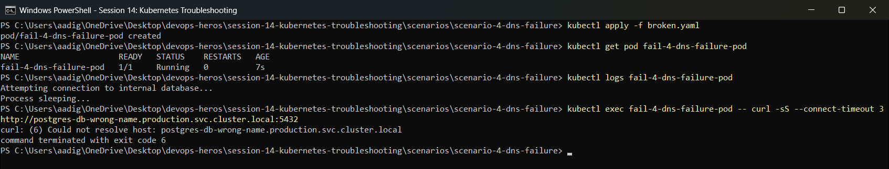

**task2/07-dns/06-scenario4-root-cause**

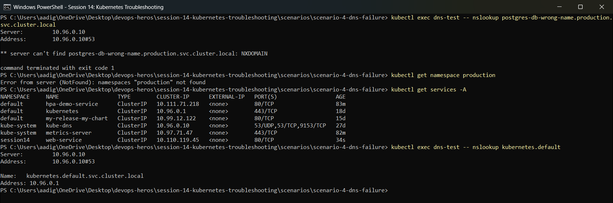

**task2/07-dns/07-scenario4-fix-verify**

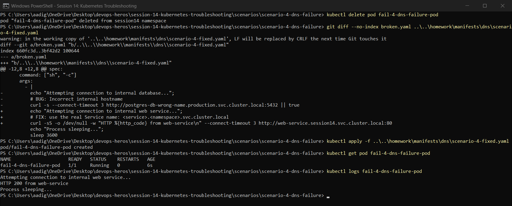


### 8. Pod networking

**Problem.** `net-client` cannot reach the HTTP server in `net-server` by Pod IP: `wget http://<pod-ip>:8080` gets *Connection refused*.

**Investigation.**
```powershell
kubectl get pods net-server net-client -o wide
kubectl exec net-server -- wget -qO- http://127.0.0.1:8080     # works from inside the Pod
kubectl exec net-server -- netstat -tln                        # 127.0.0.1:8080 LISTEN
kubectl get pod net-server -o jsonpath='{.spec.containers[0].command}'   # --bind 127.0.0.1
```

**Root cause.** The server binds only to the loopback interface. Traffic arriving on the Pod's eth0 IP finds no listener. The cluster network itself is fine.

**Fix.** `--bind 0.0.0.0` ([manifests/networking/server-fixed.yaml](manifests/networking/server-fixed.yaml)).

**Verify.** `netstat` shows `0.0.0.0:8080`, and `net-client` gets the directory listing over the Pod IP.

**task2/08-networking/01-identify**

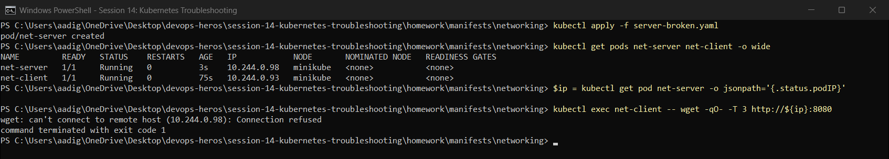

**task2/08-networking/02-investigate**

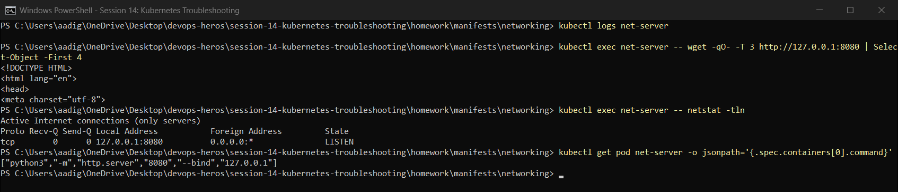

**task2/08-networking/03-fix-verify**

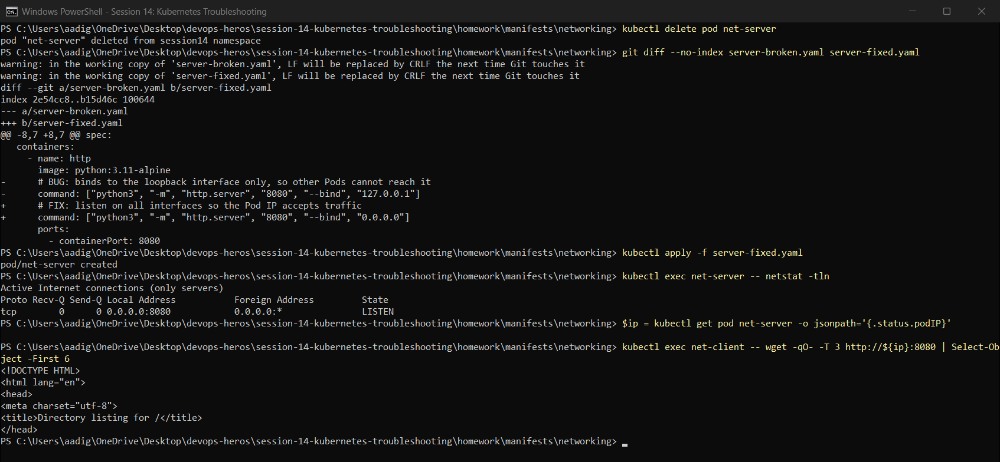


### 9. Extra: OOMKilled (scenario 5)

**Problem.** The Pod shows `OOMKilled` and keeps restarting (4 restarts in 2 minutes).

**Investigation.** `kubectl describe` shows `Last State: Terminated, Reason: OOMKilled, Exit Code: 137` and `Limits: memory: 20Mi`.

**Root cause.** The app appends 100 × 10 MB chunks to a list, about 1000 MB in total, under a 20Mi limit, so the kernel kills it. (The comment in the YAML says 200 MB; the code allocates about 1000 MB.)

**Fix.** Fix the code: process one chunk at a time, keep the process running, and set a realistic limit of 64Mi ([manifests/oomkilled/scenario-5-fixed.yaml](manifests/oomkilled/scenario-5-fixed.yaml)).

**Verify.** `1/1 Running` with 0 restarts, and the logs show `Done. Memory stayed bounded.`

**task2/09-oomkilled/01-identify**

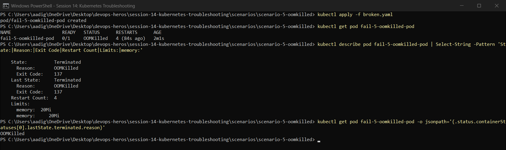

**task2/09-oomkilled/02-fix-verify**

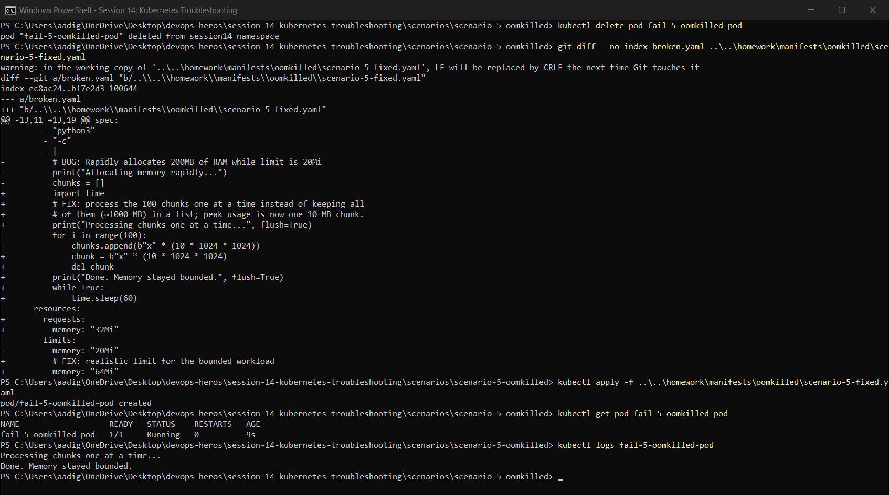


### All issues fixed

**task2/10-all-fixed**

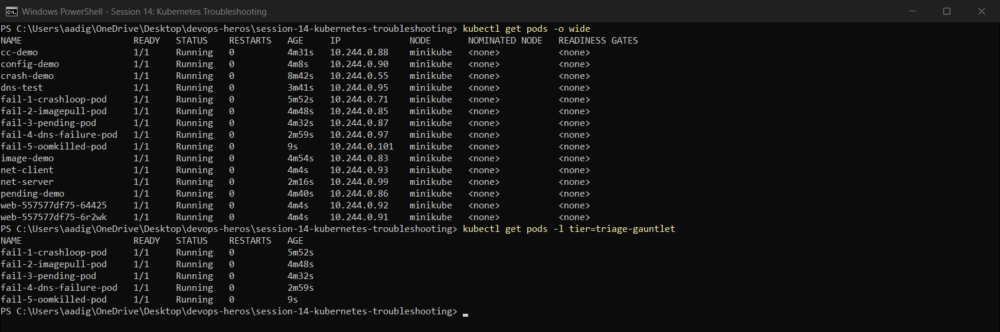


## Task 3: Mini project

**Problem statement.** A simple nginx application (Deployment `troubleshooting-app`, 2 replicas, and Service `troubleshooting-service`) should be reachable through the Service. The team reported problems: a broken Pod and, later, a Service that stopped routing traffic.

### Steps and commands

```powershell
kubectl apply -f deployment.yaml
kubectl apply -f service.yaml
kubectl get pods -o wide
kubectl describe pod <pod>
kubectl logs <pod>
kubectl exec <pod> -- curl -s localhost
kubectl describe service troubleshooting-service
kubectl get endpoints troubleshooting-service

kubectl apply -f broken-pod.yaml
kubectl get pod project-broken-pod
kubectl describe pod project-broken-pod
kubectl events --for pod/project-broken-pod

kubectl apply -f ..\homework\manifests\mini-project\service-wrong-selector.yaml   # selector app: wrong-app
kubectl get endpoints troubleshooting-service
kubectl get pods --show-labels
kubectl describe service troubleshooting-service
kubectl apply -f service.yaml                                                     # restore app: troubleshooting-app
```

### Broken Pod questions

1. **What is the Pod status?** First `ErrImagePull`, then `ImagePullBackOff`, `0/1` ready.
2. **What is the actual error?** `Failed to pull image "nginx:this-tag-does-not-exist": ... not found`.
3. **Which command helped you find the reason?** `kubectl describe pod project-broken-pod`, in the Events section. `kubectl events --for pod/project-broken-pod` shows the same events.
4. **What is wrong with the image?** The repository (`nginx`) is fine, but the tag `this-tag-does-not-exist` does not exist.
5. **How would you fix it?** Change the image to a published tag, `nginx:1.27`, then delete and re-apply the Pod ([manifests/mini-project/fixed-pod.yaml](manifests/mini-project/fixed-pod.yaml)). Verified `1/1 Running`.

### Troubleshooting table

| Problem | What I saw | Command I used | Root cause | Fix |
| :--- | :--- | :--- | :--- | :--- |
| **Broken Pod** | `project-broken-pod 0/1 ImagePullBackOff` | `kubectl get pod`, `kubectl describe pod` | The container image cannot be pulled, so the container never starts | Recreate the Pod with a valid image |
| **Service Problem** | `troubleshooting-service` Endpoints `<none>`; `wget` from `net-client`: Connection refused | `kubectl get endpoints`, `kubectl get pods --show-labels`, `kubectl describe service` | Selector `app=wrong-app`, but the Pods are labelled `app=troubleshooting-app` | Re-apply `service.yaml` with selector `app: troubleshooting-app`; endpoints are back and `wget` returns nginx |
| **Image Problem** | `Failed to pull image "nginx:this-tag-does-not-exist" ... not found` | `kubectl events --for pod/project-broken-pod` | The tag does not exist in the registry | `image: nginx:1.27` |

### Before / after

Before (broken Pod and broken selector):
```text
project-broken-pod   0/1   ImagePullBackOff   0
troubleshooting-service   <none>
```
After:
```text
project-broken-pod   1/1   Running   0
troubleshooting-service   <pod-ip-1>:80,<pod-ip-2>:80
```
The exact IPs are in the screenshots and in [`outputs/task3/`](outputs/task3/).

**task3/01-deploy**

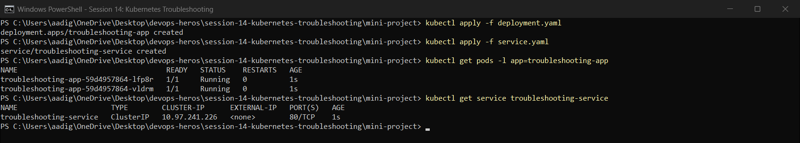

**task3/02-check-app-part1**

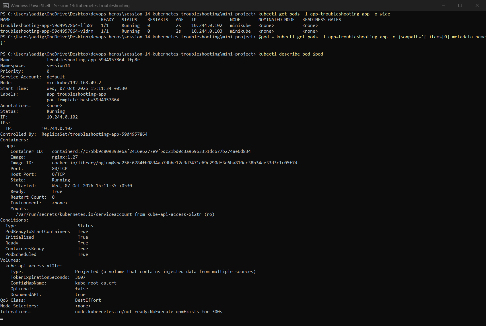

**task3/02-check-app-part2**

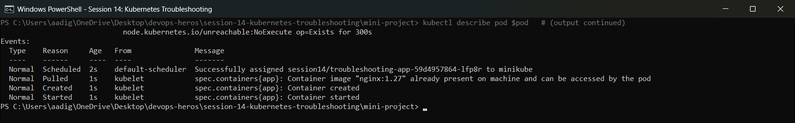

**task3/03-logs-exec-part1**

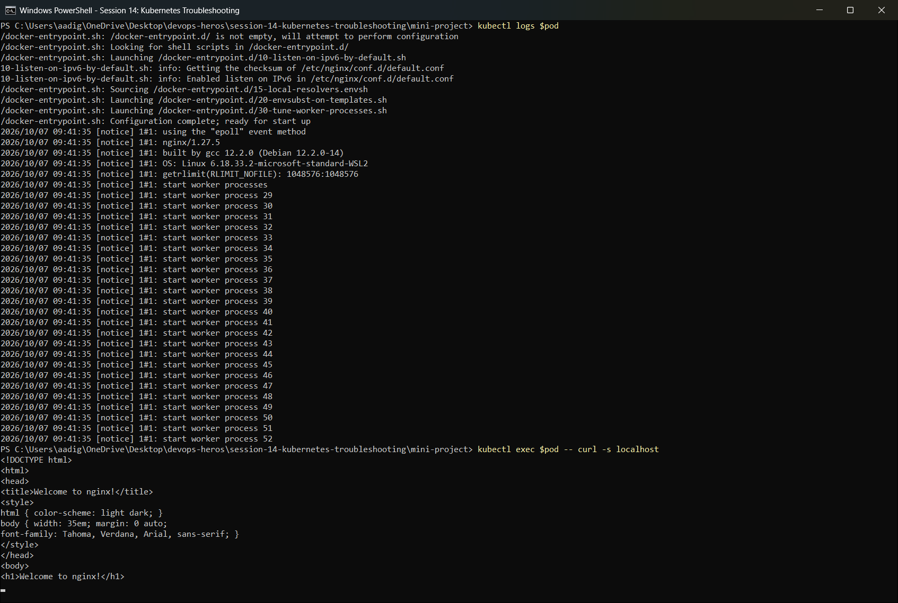

**task3/03-logs-exec-part2**

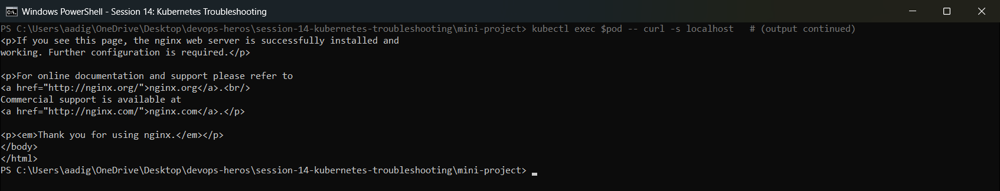

**task3/04-check-service**

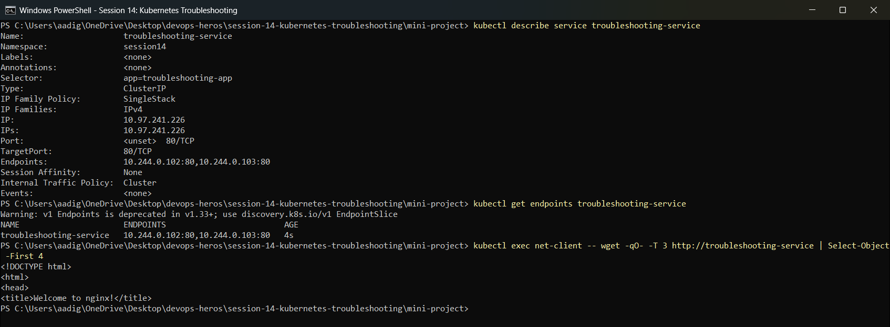

**task3/05-broken-pod-identify**

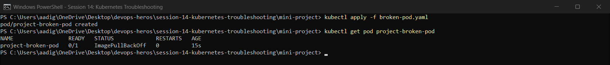

**task3/06-broken-pod-describe-part1**

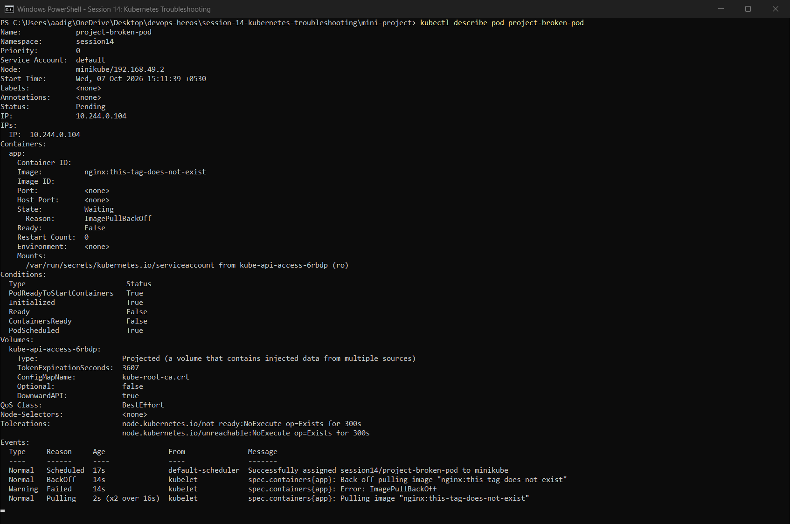

**task3/06-broken-pod-describe-part2**

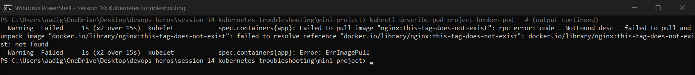

**task3/07-broken-pod-events**

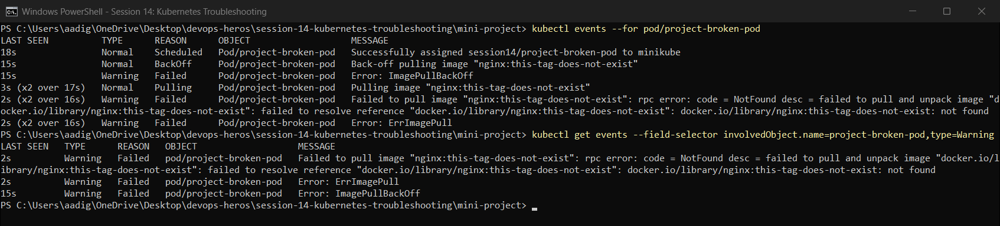

**task3/08-broken-pod-fix-verify**

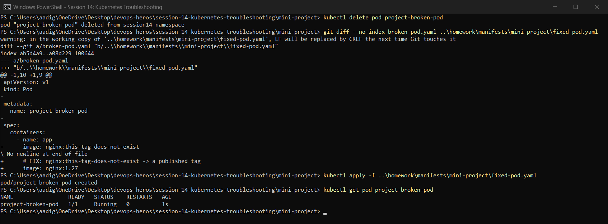

**task3/09-service-break**

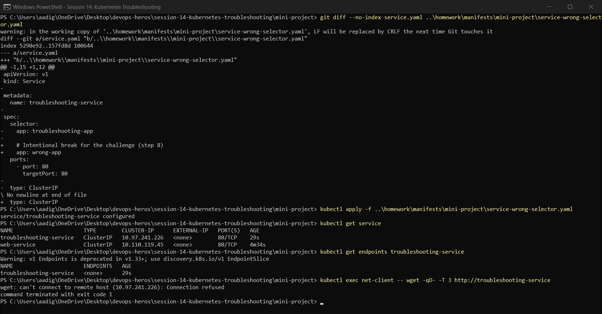

**task3/10-service-root-cause**

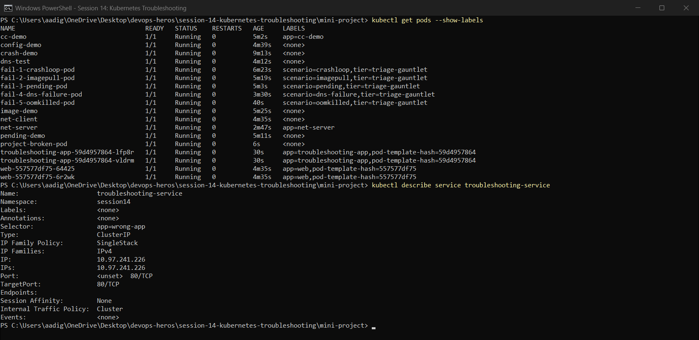

**task3/11-service-fix-verify**

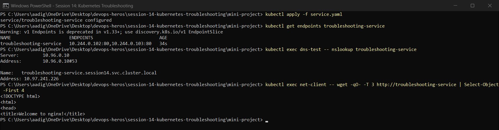

**task3/12-final-state**

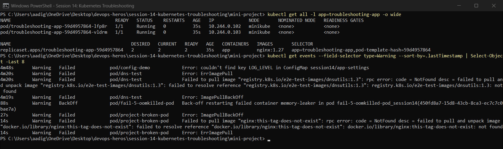


### README questions

1. **What does `kubectl get` tell us?** The current state of resources at a glance: name, READY containers, STATUS, RESTARTS and AGE (plus IP and node with `-o wide`). It tells you *what* is happening.
2. **What is the difference between `get` and `describe`?** `get` is a one-line summary per resource. `describe` is a detailed report of one resource: spec, container state and last state, exit codes, conditions, mounts, and the related Events. `describe` is where you start finding *why*.
3. **Why do we use `kubectl logs`?** To read what the application wrote to stdout/stderr. The error message is often there (for example a missing env var). `--previous` shows the logs of the last crashed container.
4. **When would you use `kubectl exec`?** When the container is running and you need to check from inside: whether the app answers on `localhost`, which ports it listens on, config files, environment variables, DNS resolution. It narrows a problem down to the app, the Service, DNS or the network. It is not useful while the container keeps crashing.
5. **What does `CrashLoopBackOff` mean?** The container starts, exits, and is restarted repeatedly, with kubelet waiting longer each time (10s, 20s, 40s ... up to 5 min). It is a symptom; the cause is in the logs and the exit code.
6. **What does `ImagePullBackOff` mean?** Kubelet could not pull the image (wrong name or tag, private registry without credentials, registry or network unreachable) and is waiting before retrying. `ErrImagePull` is the failed attempt itself.
7. **Why can a Pod remain `Pending`?** The scheduler cannot place it: not enough CPU or memory for its requests, a nodeSelector, affinity or taint that no node satisfies, or an unbound PVC. The `FailedScheduling` event says which.
8. **Why can a Service have no endpoints?** Its selector matches no Pods (a label typo or wrong selector), or the matching Pods are not Ready, or they are in another namespace.
9. **What is the relationship between a Service selector and Pod labels?** The Service selects every Ready Pod whose labels contain all the selector's key/value pairs. Those Pods' IPs become the Service endpoints. If the labels and the selector don't match, the Service has no backends.
10. **What is Kubernetes DNS?** CoreDNS, running in `kube-system` behind the `kube-dns` Service (10.96.0.10). It gives every Service a name, `<service>.<namespace>.svc.cluster.local`. Pods get it as their nameserver in `/etc/resolv.conf`, with search domains that make the short name `web-service` work inside the same namespace.

## Cleanup

All homework resources were in the `session14` namespace. Deleting the namespace removed them, and the kubectl context was set back to `default`. Resources from earlier sessions in `default` were not touched.

```powershell
kubectl delete namespace session14
kubectl get namespace session14     # NotFound
kubectl config set-context --current --namespace=default
```

**cleanup/01-delete-namespace**

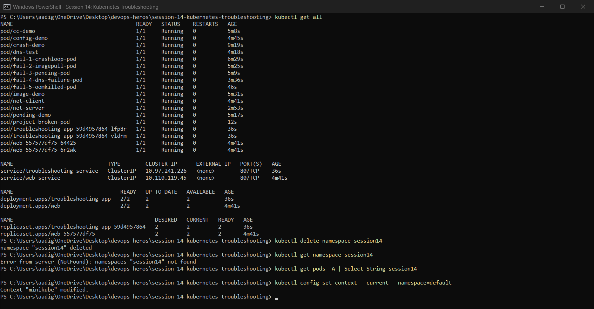

