# Session 15 Homework: Helm

All exercises in `session-15-helm/` (folders 01-09 and the mini project) were done on the local **minikube** cluster with **Helm v4.3.0** from a Windows PowerShell terminal.
Everything ran in its own namespace, `session15`, which was deleted at the end (see [Cleanup](#cleanup)).

Each command and its output is captured in a terminal screenshot under [`screenshots/`](screenshots/), and the plain-text transcript of every step is in [`outputs/`](outputs/).
The chart generated with `helm create` is in [`my-first-chart/`](my-first-chart/).

Note: the screenshots use PowerShell's `Select-String` wherever the course README uses `grep`.

## Contents

- [Setup](#setup)
- [01 What is Helm](#01-what-is-helm)
- [02 Helm charts](#02-helm-charts)
- [03 Chart structure](#03-chart-structure)
- [04 Chart.yaml](#04-chartyaml)
- [05 values.yaml](#05-valuesyaml)
- [06 Templates](#06-templates)
- [07 Install and upgrade](#07-install-and-upgrade)
- [08 Rollback](#08-rollback)
- [09 Deploying an application](#09-deploying-an-application)
- [Mini project: Notes App](#mini-project-notes-app)
- [Cleanup](#cleanup)
- [Key learnings](#key-learnings)

## Setup

```powershell
kubectl apply -f manifests\namespace.yaml
kubectl config set-context --current --namespace=session15
helm version
helm list
```

**00-setup/01-namespace**

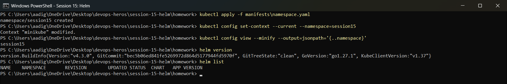


## 01 What is Helm

Helm is the package manager for Kubernetes. A **chart** is a package of templated manifests, a **release** is one installed instance of a chart, and **values** are the inputs that customise it.

```powershell
helm repo add bitnami https://charts.bitnami.com/bitnami
helm repo update
helm search repo bitnami/nginx
helm install my-nginx bitnami/nginx
helm list
kubectl get pods
kubectl get services
helm uninstall my-nginx
```

Result: `bitnami/nginx` chart 25.2.1 (app 1.31.6) installed and its Pod reached `1/1 Running`. The Service is a `LoadBalancer`, so on minikube its EXTERNAL-IP stays `<pending>` (it would need `minikube tunnel`). The chart printed a notice that since 28 August 2025 Bitnami offers only a limited set of free images and charts, and warned that it uses rolling `latest` tags.

**01-what-is-helm/01-repo**

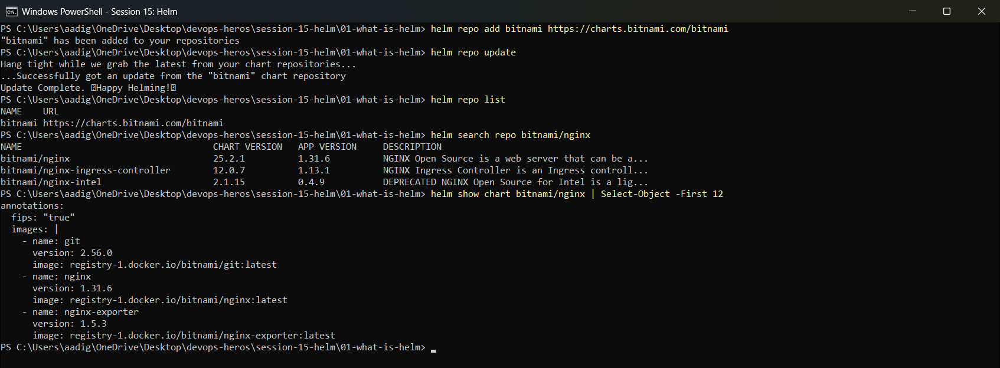

**01-what-is-helm/02-install-public-chart**

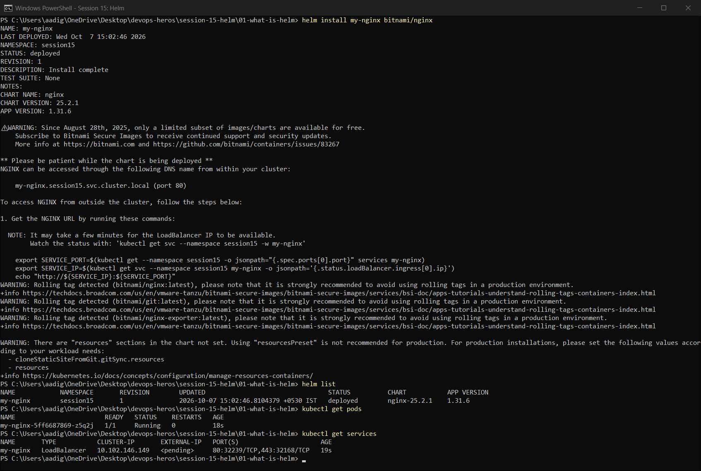

**01-what-is-helm/03-uninstall**

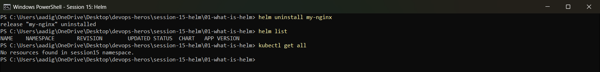


## 02 Helm charts

`helm create` generates a working chart skeleton. `helm template` renders it locally without touching the cluster. `helm install` deploys it, and `helm uninstall` removes everything the release created.

```powershell
helm create my-first-chart
helm template my-release my-first-chart
helm install demo-release my-first-chart
kubectl get pods
helm list
helm status demo-release
helm uninstall demo-release
```

**02-helm-charts/01-create**

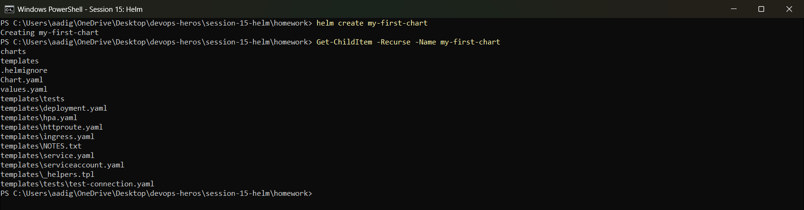

**02-helm-charts/02-template-part1**

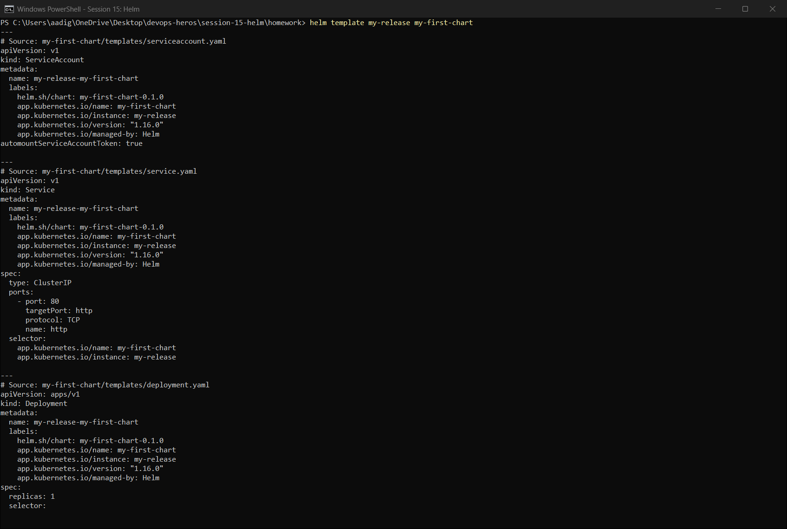

**02-helm-charts/02-template-part2**

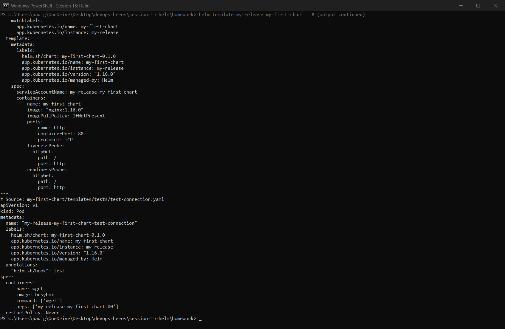

**02-helm-charts/03-install-part1**

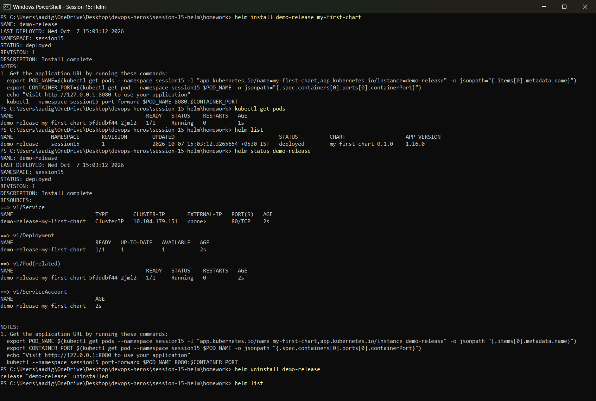

**02-helm-charts/03-install-part2**

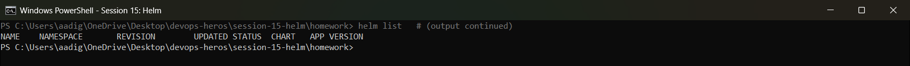


## 03 Chart structure

```text
simple-chart/
  Chart.yaml        # chart metadata (name, version, appVersion)
  values.yaml       # default configuration
  templates/        # Kubernetes manifests with {{ }} placeholders
    deployment.yaml
    service.yaml
```

```powershell
helm template my-release simple-chart
helm install my-release simple-chart
kubectl get pods
kubectl get services
helm uninstall my-release
```

**03-chart-structure/01-files**

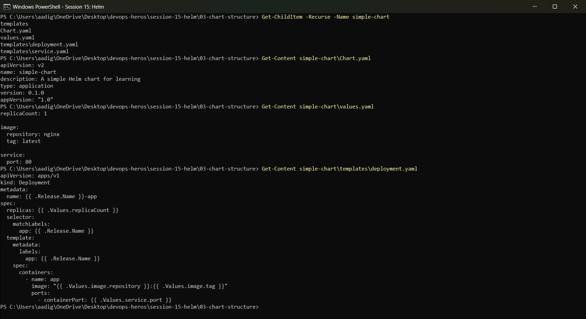

**03-chart-structure/02-template-install**

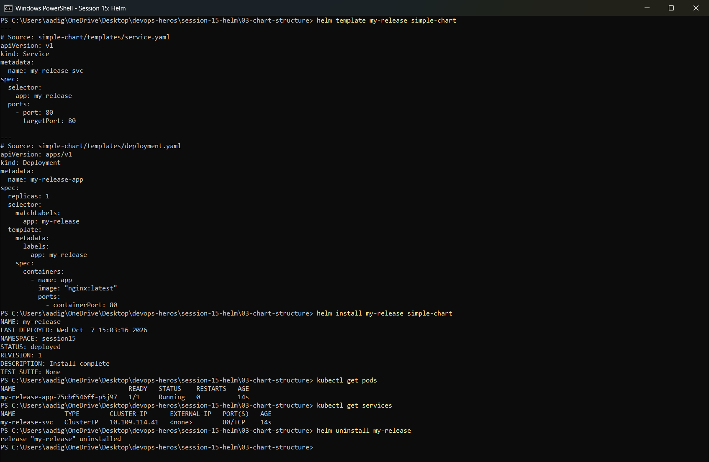


## 04 Chart.yaml

`apiVersion`, `name` and `version` are required. `version` is the version of the chart itself, bumped whenever the chart changes. `appVersion` is the version of the application the chart deploys. The default templates put both into labels (`helm.sh/chart`, `app.kubernetes.io/version`).

```powershell
helm lint ..\05-values-yaml\my-app
helm show chart ..\05-values-yaml\my-app
```

**04-chart-yaml/01-chart-yaml**

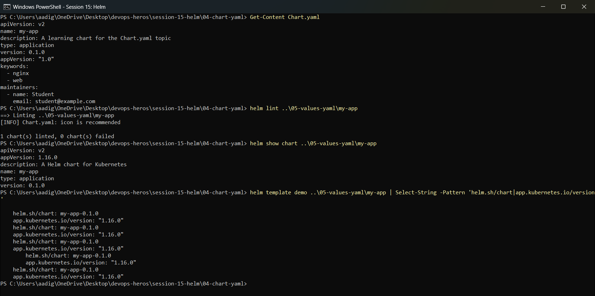


## 05 values.yaml

Value priority, highest first: `--set` > `-f values-file` > the chart's `values.yaml`.

```powershell
helm template my-app .\my-app | Select-String -Pattern replicas:,image:
helm template my-app .\my-app --set replicaCount=3 | Select-String -Pattern replicas:
helm template my-app .\my-app -f values-prod.yaml | Select-String -Pattern replicas:
helm template my-app .\my-app -f values-prod.yaml --set replicaCount=2 | Select-String -Pattern replicas:
helm install my-app .\my-app --set replicaCount=3
helm get values my-app
```

Result: defaults gave `replicas: 1`, `--set replicaCount=3` gave 3, `-f values-prod.yaml` gave 5, and `-f values-prod.yaml --set replicaCount=2` gave 2, which shows that `--set` wins. `helm get values` lists only the user-supplied override (`replicaCount: 3`).

**05-values-yaml/01-values**

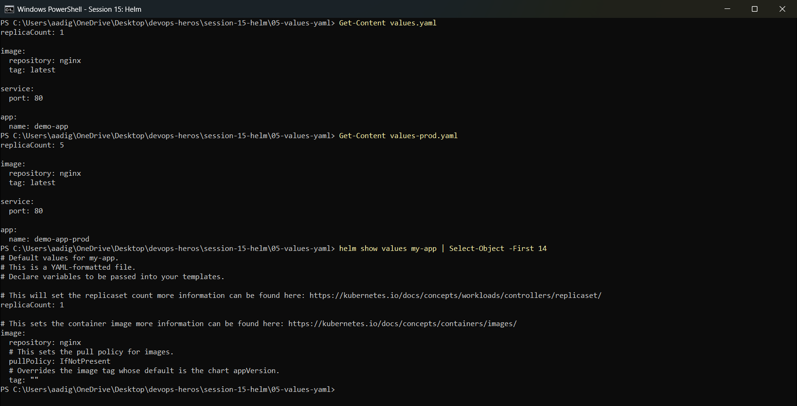

**05-values-yaml/02-overrides**

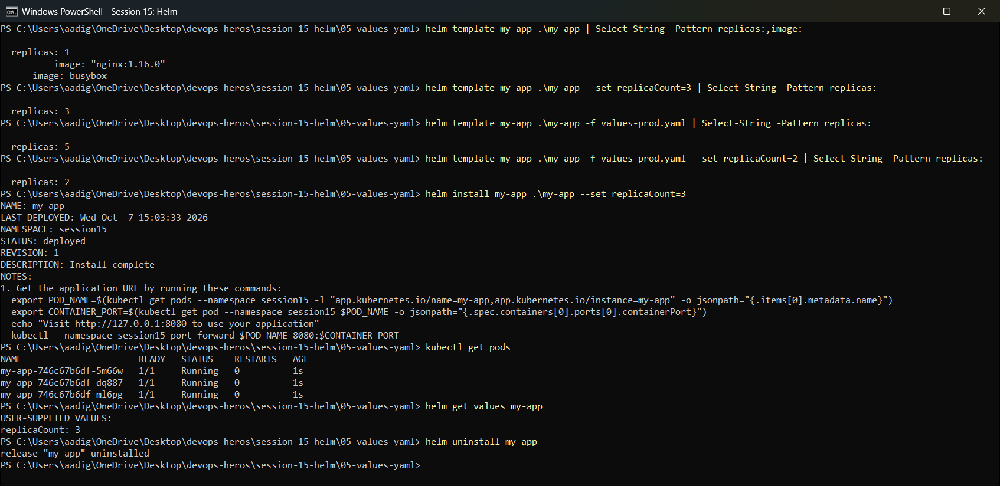


## 06 Templates

`{{ .Values.x }}`, `{{ .Release.Name }}` and `{{ .Chart.Name }}` are filled in at render time. `{{- if .Values.service.enabled }}` makes the Service optional.

```powershell
helm template my-release template-demo
helm template my-release template-demo --set replicaCount=5 | Select-String -Pattern replicas:
helm template my-release template-demo --set service.enabled=false | Select-String -Pattern '^kind:'
```

With `service.enabled=false`, only the `Deployment` is rendered.

**06-templates/01-template-files**

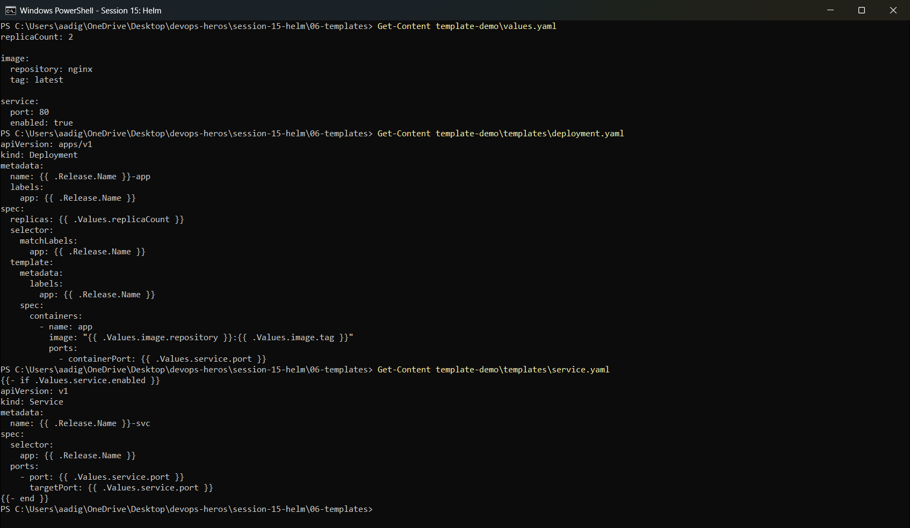

**06-templates/02-render**

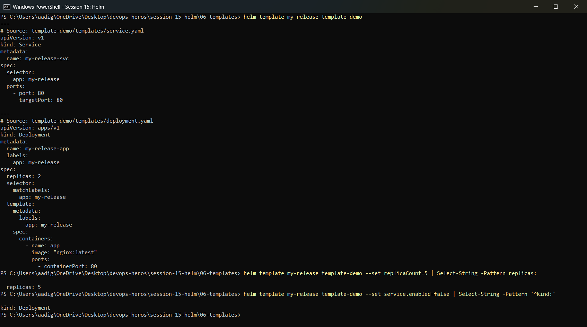


## 07 Install and upgrade

```powershell
helm install web-app ./app-chart
helm upgrade web-app ./app-chart --set replicaCount=3
helm history web-app
helm install web-app ./app-chart              # fails: release already exists
helm upgrade --install web-app ./app-chart    # upgrades because it exists
helm uninstall web-app
```

`helm install` fails if the release already exists, `helm upgrade` fails if it does not, and `helm upgrade --install` works in both cases (the usual CI/CD form).

**07-install-upgrade/01-install**

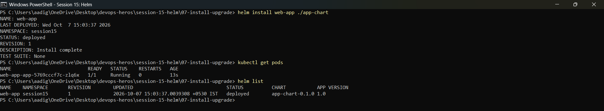

**07-install-upgrade/02-upgrade**

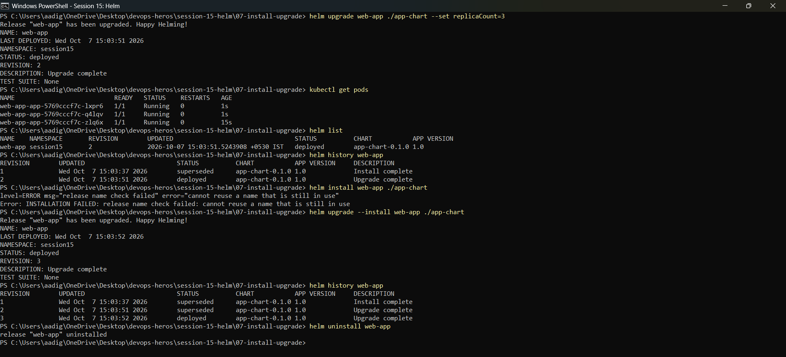


## 08 Rollback

```powershell
helm install rollback-demo ..\07-install-upgrade\app-chart
helm upgrade rollback-demo ..\07-install-upgrade\app-chart --set image.tag=doesnotexist
kubectl get pods                 # new pod in ErrImagePull/ImagePullBackOff, old pod still serving
helm history rollback-demo
helm rollback rollback-demo 1
helm history rollback-demo       # rollback creates a NEW revision
helm upgrade rollback-demo ..\07-install-upgrade\app-chart --set image.tag=doesnotexist --atomic --timeout 60s
helm history rollback-demo
helm uninstall rollback-demo
```

Result: the broken upgrade (revision 2) left the old Pod running next to a new Pod in `ImagePullBackOff`; the Deployment rolling update does not remove the healthy Pod. `helm rollback rollback-demo 1` created revision 3, `Rollback to 1`. The `--atomic` upgrade failed its 60 s readiness wait. Helm marked revision 4 `failed` and created revision 5, `Rollback to 3`, by itself. In Helm v4, `--atomic` still works but prints `Flag --atomic has been deprecated, use --rollback-on-failure instead`.

**08-rollback/01-broken-upgrade**

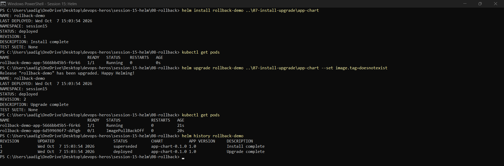

**08-rollback/02-rollback**

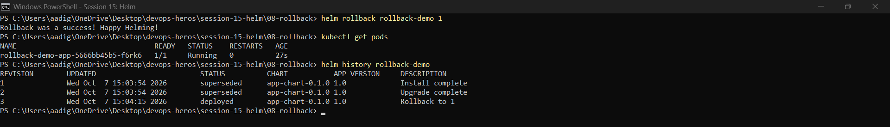

**08-rollback/03-atomic**

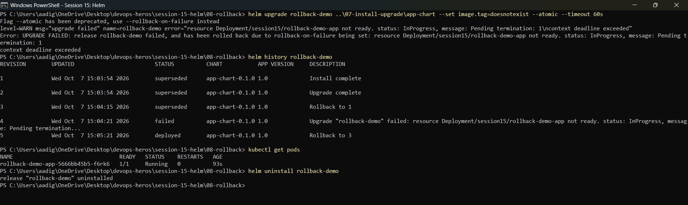


## 09 Deploying an application

The guestbook chart has a ConfigMap (`welcome`, `appName`), a Deployment that loads it with `envFrom`, and a NodePort Service.

```powershell
helm lint guestbook-chart
helm template my-guestbook guestbook-chart
helm install my-guestbook guestbook-chart
kubectl get pods; kubectl get services; kubectl get configmaps
kubectl exec deploy/my-guestbook-app -- printenv welcome appName
helm upgrade my-guestbook guestbook-chart --set replicaCount=3
helm history my-guestbook
helm rollback my-guestbook 1
helm uninstall my-guestbook
```

**09-deploying-application/01-lint-template-part1**

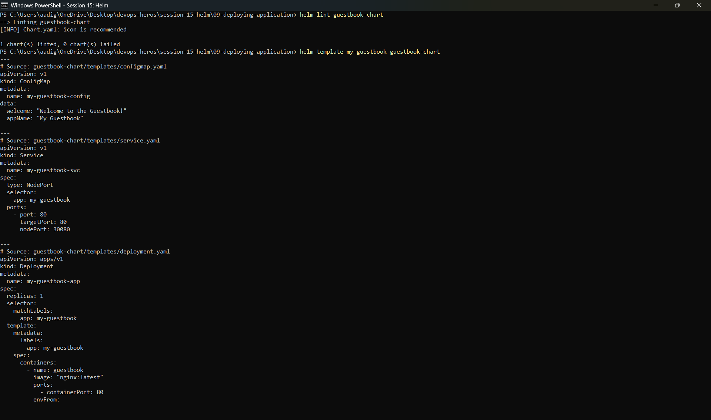

**09-deploying-application/01-lint-template-part2**

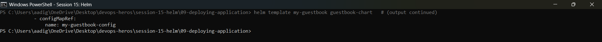

**09-deploying-application/02-install-verify**

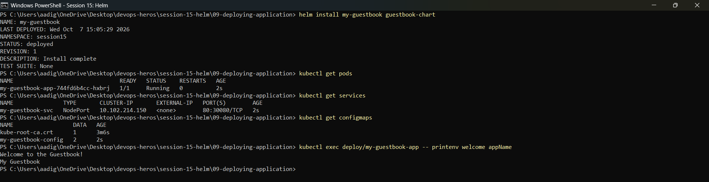

**09-deploying-application/03-upgrade-rollback**

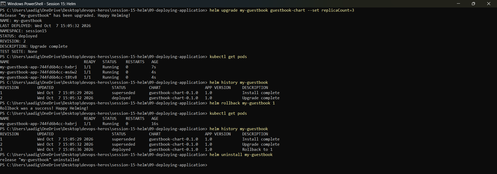


## Mini project: Notes App

**Goal.** Package the Notes app (nginx standing in for a web app) as a Helm chart with dev and prod values, deploy it, upgrade it to production, simulate a bad release, and roll back.

```text
notes-chart/
  Chart.yaml
  values.yaml        # dev: 1 replica, nginx:1.24, environment=development
  values-prod.yaml   # prod: 3 replicas, nginx:1.25, environment=production
  templates/
    configmap.yaml   # APP_NAME, ENVIRONMENT
    deployment.yaml  # envFrom the ConfigMap
    service.yaml     # NodePort 30090
```

| Step | Command | Result |
| :--- | :--- | :--- |
| Lint | `helm lint notes-chart` | `1 chart(s) linted, 0 chart(s) failed` (only `[INFO] icon is recommended`) |
| Render | `helm template notes-dev notes-chart` | All `{{ }}` placeholders replaced |
| Install (dev) | `helm install notes-dev notes-chart` | Revision 1, 1 Pod Running, NodePort `80:30090`, ConfigMap `notes-dev-config`; `printenv` → `notes-app` / `development`; `curl localhost` → nginx welcome page |
| Upgrade (prod) | `helm upgrade notes-dev notes-chart -f notes-chart/values-prod.yaml` | Revision 2, 3/3 Pods on `nginx:1.25`, `ENVIRONMENT=production` |
| Bad upgrade | `helm upgrade notes-dev notes-chart --set image.tag=broken-tag-does-not-exist` | Revision 3 reported `deployed`, but the new Pod is `ImagePullBackOff`; one old Pod keeps serving |
| Rollback | `helm rollback notes-dev 2` | `Rollback was a success! Happy Helming!`; revision 4 `Rollback to 2`; 3/3 Pods on `nginx:1.25` again |
| Uninstall | `helm uninstall notes-dev` | `No resources found` for Pods and Services, and `helm list` is empty |

Lesson from the bad upgrade: `helm upgrade` without `--wait`/`--atomic` reports `STATUS: deployed` as soon as the manifests are applied, even though the new Pods never become ready. Check `kubectl get pods`, or use `--wait` / `--rollback-on-failure`. Each revision is stored as a Secret (`sh.helm.release.v1.notes-dev.v1` to `v4`).

```text
[PASS] Created a Helm chart from scratch
[PASS] Used values.yaml and values-prod.yaml
[PASS] Deployed to Kubernetes with helm install
[PASS] Upgraded the release with different values
[PASS] Simulated a bad upgrade (broken image tag)
[PASS] Rolled back to a healthy revision
[PASS] Cleaned up with helm uninstall
```

**mini-project/01-lint-template-part1**

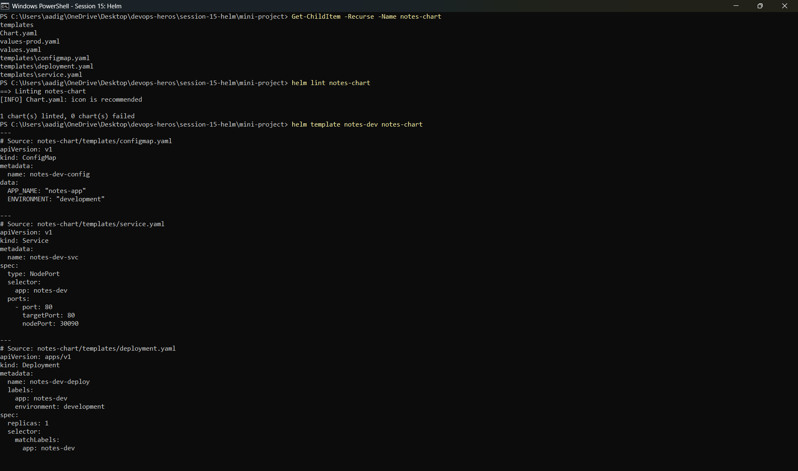

**mini-project/01-lint-template-part2**

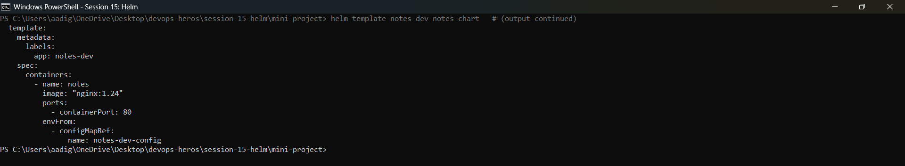

**mini-project/02-install-dev**

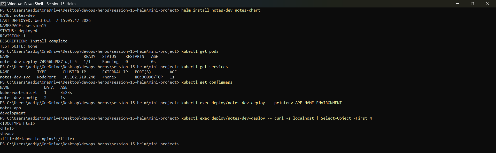

**mini-project/03-upgrade-prod**

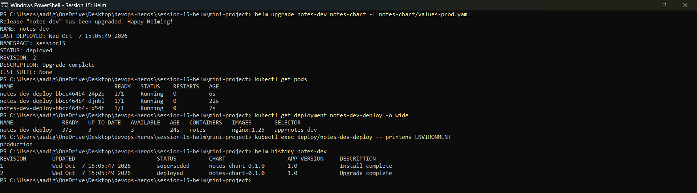

**mini-project/04-bad-upgrade**

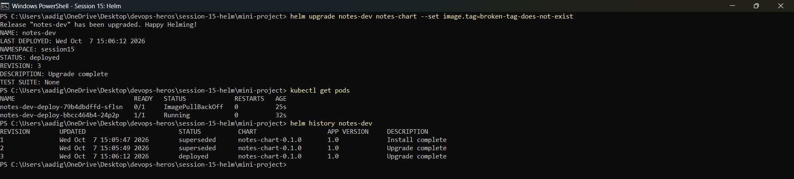

**mini-project/05-rollback**

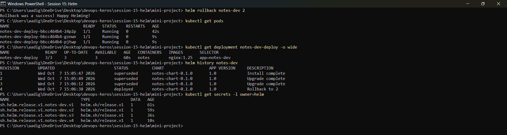

**mini-project/06-uninstall**

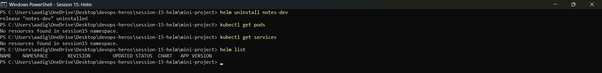


## Cleanup

All releases were uninstalled, the `session15` namespace was deleted, the `bitnami` repo that was added for exercise 01 was removed (no repos were configured before), and the kubectl context was set back to `default`.

```powershell
helm list -A
kubectl delete namespace session15
helm repo remove bitnami
kubectl config set-context --current --namespace=default
```

**cleanup/01-cleanup**

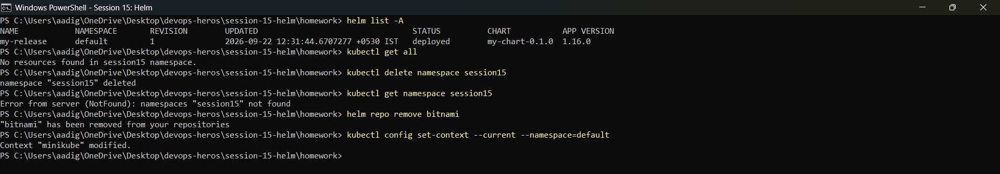


## Key learnings

- **Chart vs release:** one chart can be installed many times, and each install is a separate release with its own revision history.
- **Render before you deploy:** `helm lint` and `helm template` catch mistakes without touching the cluster.
- **Values priority:** `--set` > `-f file` > `values.yaml`. Keep per-environment values files in Git rather than long `--set` chains.
- **Rollback is a new revision:** `helm rollback` re-applies an old revision's manifests as revision N+1, so the history stays auditable.
- **`--atomic`** rolls an upgrade back automatically if it does not become healthy within `--timeout`.
- **Helm 3+ has no Tiller:** release state lives in Secrets (`owner=helm`) in the release namespace, and Helm uses your kubeconfig permissions.
