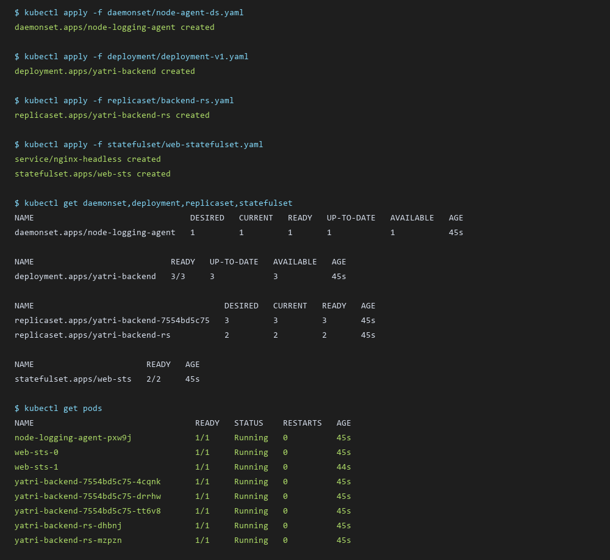
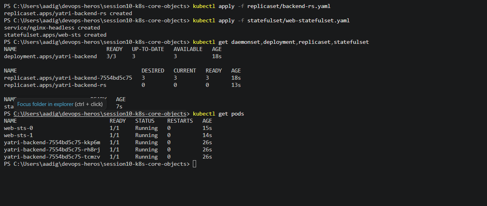

# Session 10: Kubernetes Core Workload Objects

> **Homework Submission**: Pods, ReplicaSets, Deployments, DaemonSets & StatefulSets

---

## 1. Conceptual Breakdown of Workload Objects

### What is a DaemonSet?
A **DaemonSet** ensures that a single copy of a specific Pod runs on **all (or selected) worker nodes** in the cluster.
- When a new node is added to the cluster, the DaemonSet automatically schedules a pod onto it.
- When a node is removed, the pod is garbage collected.
- **Common Use Cases**:
  - Log collection agents (`fluentd`, `logstash`, `promtail`).
  - Node monitoring daemons (`node-exporter`, `datadog-agent`).
  - Cluster networking plugins (`kube-proxy`, `calico-node`, `weave-net`).

### What is a Deployment?
A **Deployment** is a high-level declarative manager for stateless workloads.
- Manages underlying **ReplicaSets** to handle Pod creation, scaling, self-healing, rolling updates, and rollbacks.
- Provides zero-downtime updates via declarative spec changes (`spec.strategy.type: RollingUpdate`).
- **Common Use Cases**:
  - Stateless web applications, microservices, REST APIs, frontend UI servers.

### What is a ReplicaSet?
A **ReplicaSet** ensures that a specified number of identical pod replicas are running at any given time.
- Uses label selectors (`spec.selector.matchLabels`) to track and manage pod instances.
- While ReplicaSets can be created independently, they are almost always managed indirectly via **Deployments**.

### What is a StatefulSet?
A **StatefulSet** manages stateful applications requiring **unique network identities and persistent, ordered storage**.
- Unlike Deployments (where pods are interchangeable and assigned random hashes), StatefulSet pods receive:
  1. **Ordinal Indexing**: Pod names follow a deterministic index (e.g. `web-sts-0`, `web-sts-1`).
  2. **Sticky Network Identity**: Stable DNS entry via Headless Service (e.g., `web-sts-0.nginx-headless.default.svc.cluster.local`).
  3. **Ordered Rollouts & Storage Binding**: Pods start sequentially from `0` to `N-1` and bind to dedicated PersistentVolumeClaims (`volumeClaimTemplates`).
- **Where StatefulSets are used**:
  - Distributed databases (PostgreSQL, MySQL Master/Replica, MongoDB Replica Sets, Cassandra, CockroachDB).
  - Messaging queues & caches (Kafka, RabbitMQ, Redis Sentinel, ZooKeeper).

---

## 2. Core Objects Comparison Table

| Feature | ReplicaSet | Deployment | DaemonSet | StatefulSet |
| :--- | :--- | :--- | :--- | :--- |
| **Primary Goal** | Maintain pod count | Managing stateless updates & rollbacks | One pod per node | Ordered stateful workloads |
| **Pod Naming** | Random hash suffix | Random hash + Pod hash | Node hostname / random hash | Ordinal index (`web-0`, `web-1`) |
| **Storage Handling** | Ephemeral / Shared PVC | Ephemeral / Shared PVC | Local HostPath / Ephemeral | Dedicated PVC per Pod index |
| **Network Identity** | Dynamic IP via Service | Dynamic IP via Service | Host IP / NodePort | Stable DNS FQDN via Headless Svc |
| **Scaling** | Declarative replica count | Declarative replica count | Auto-scales with node count | Sequential scaling (`0 -> 1 -> 2`) |

---

## 3. Live Execution & Terminal Output

All four workload object types were applied and verified on Minikube:

```bash
$ kubectl apply -f daemonset/node-agent-ds.yaml
daemonset.apps/node-logging-agent created

$ kubectl apply -f deployment/deployment-v1.yaml
deployment.apps/yatri-backend created

$ kubectl apply -f replicaset/backend-rs.yaml
replicaset.apps/yatri-backend-rs created

$ kubectl apply -f statefulset/web-statefulset.yaml
service/nginx-headless created
statefulset.apps/web-sts created

$ kubectl get daemonset,deployment,replicaset,statefulset
```

### Terminal Output Screenshot


---

## 4. Manifest Specifications

### A. DaemonSet (`daemonset/node-agent-ds.yaml`)
```yaml
apiVersion: apps/v1
kind: DaemonSet
metadata:
  name: node-logging-agent
spec:
  selector:
    matchLabels:
      app: node-logging-agent
  template:
    metadata:
      labels:
        app: node-logging-agent
    spec:
      containers:
        - name: fluent-logger
          image: busybox:1.36
          command: ["sh", "-c", "while true; do echo \"Collecting host metrics\"; sleep 10; done"]
```

### B. Deployment (`deployment/deployment-v1.yaml`)
```yaml
apiVersion: apps/v1
kind: Deployment
metadata:
  name: yatri-backend
spec:
  replicas: 3
  selector:
    matchLabels:
      app: yatri-backend
  template:
    metadata:
      labels:
        app: yatri-backend
    spec:
      containers:
      - name: yatri-backend
        image: nginx:1.25-alpine
```

### C. ReplicaSet (`replicaset/backend-rs.yaml`)
```yaml
apiVersion: apps/v1
kind: ReplicaSet
metadata:
  name: yatri-backend-rs
spec:
  replicas: 2
  selector:
    matchLabels:
      app: yatri-backend-rs
  template:
    metadata:
      labels:
        app: yatri-backend-rs
    spec:
      containers:
      - name: backend
        image: nginx:alpine
```

### D. StatefulSet (`statefulset/web-statefulset.yaml`)
```yaml
apiVersion: v1
kind: Service
metadata:
  name: nginx-headless
spec:
  clusterIP: None
  selector:
    app: stateful-web
---
apiVersion: apps/v1
kind: StatefulSet
metadata:
  name: web-sts
spec:
  serviceName: "nginx-headless"
  replicas: 2
  selector:
    matchLabels:
      app: stateful-web
  template:
    metadata:
      labels:
        app: stateful-web
    spec:
      containers:
      - name: nginx
        image: nginx:1.25-alpine
```

