# Session 20 Homework: Monitoring, Observability and GitOps

Every exercise in `session20-monitoring-observability-gitops/` (01–08) was done on the local minikube cluster and Docker Desktop, from a Windows PowerShell terminal.

- **Prometheus and Grafana** (03, 04): run with the course `docker-compose.yml` files. Queries and configuration go through their HTTP APIs, which are the same calls the web UIs make.
- **Argo CD** (07): installed from the official `stable` manifest and synced from the course repo `github.com/Nency-Ravaliya/gitops-demo`.
- **Mini project** (08): instead of a GitHub repo, an **in-cluster Git server** ([git-server/git-server.yaml](git-server/git-server.yaml), a `git daemon` pod) holds the manifests. I push to it through `kubectl port-forward`, and Argo CD pulls from `git://git-server.gitserver.svc.cluster.local/gitops.git`. Nothing leaves this machine.

Each command and its output is captured in a terminal screenshot under [`screenshots/`](screenshots/), and the plain-text transcript of every step is in [`outputs/`](outputs/).

## Contents

- [01 Monitoring vs observability](#01-monitoring-vs-observability)
- [02 Metrics, logs and traces](#02-metrics-logs-and-traces)
- [03 Prometheus](#03-prometheus)
- [04 Grafana](#04-grafana)
- [05 Introduction to GitOps](#05-introduction-to-gitops)
- [06 Git as source of truth](#06-git-as-source-of-truth)
- [07 Argo CD](#07-argo-cd)
- [08 Mini project](#08-mini-project)
- [Cleanup](#cleanup)
- [Viva answers](#viva-answers)

**00-setup/01-cluster**

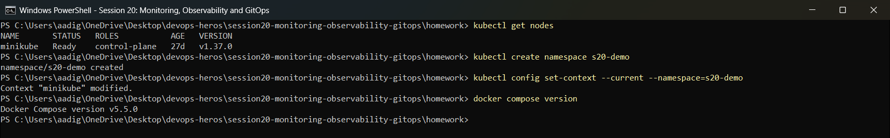


## 01 Monitoring vs observability

- **Monitoring** answers known questions: is the service up, and is CPU above 80%?
- **Observability** lets you ask new questions about unknown failures, using the three signals: **metrics** (numbers over time), **logs** (events) and **traces** (one request's path across services).

## 02 Metrics, logs and traces

```powershell
kubectl apply -f k8s-demo/
kubectl logs deployment/session20-demo        # logs: "Request received", "Health check OK"
kubectl describe deployment session20-demo
kubectl top pods                              # metrics from metrics-server
kubectl get events --sort-by=.lastTimestamp   # Kubernetes events
kubectl delete -f k8s-demo/
```

**02-metrics-logs-traces/01-demo-part1**

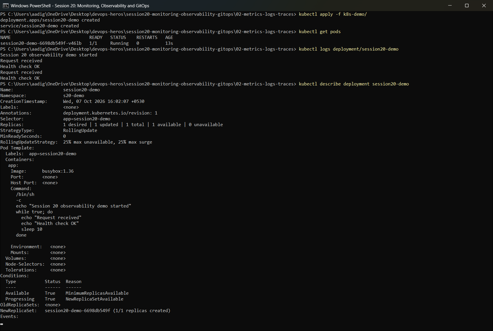

**02-metrics-logs-traces/01-demo-part2**

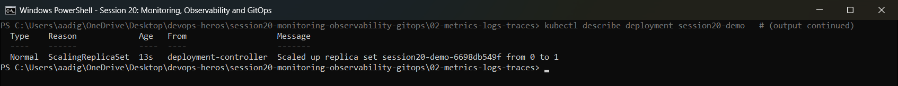

**02-metrics-logs-traces/02-metrics-cleanup**

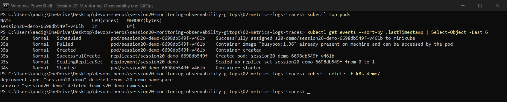


## 03 Prometheus

```powershell
docker compose up -d      # prom/prometheus:v3.5.0, scrape_interval 5s, scrapes itself
```

| Query | Result |
| :--- | :--- |
| Targets | `http://prometheus:9090/metrics`, health **up** |
| `up` | `up{instance="prometheus:9090",job="prometheus"} = 1` |
| `topk(5, prometheus_http_requests_total)` | Request counts per handler and status code |
| `process_cpu_seconds_total` | CPU seconds used by Prometheus |
| `sum(rate(prometheus_http_requests_total[1m]))` | Requests per second (PromQL `rate`) |
| `/metrics` | Raw exposition format (`process_*` series) |

`docker compose down` stops it.

**03-prometheus/01-start**

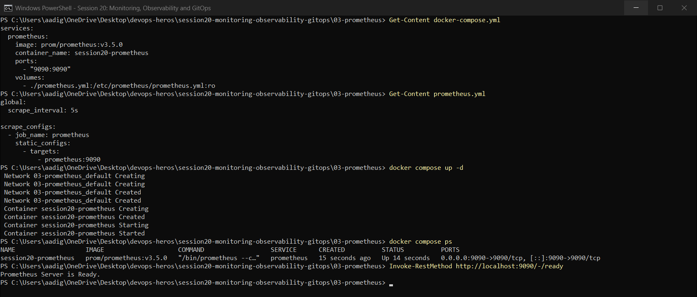

**03-prometheus/02-queries**

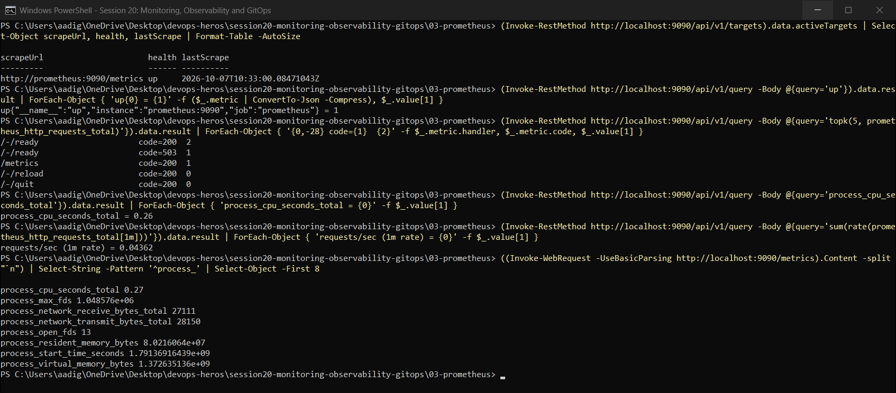

**03-prometheus/03-stop**

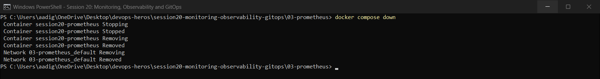


## 04 Grafana

```powershell
docker compose up -d      # Prometheus + grafana/grafana:12.1.1 on :3000
```

These steps follow the README's UI steps, done through Grafana's HTTP API:
1. **Add data source**: `POST /api/datasources` with `{type: prometheus, url: http://prometheus:9090}`. The health check returns `Successfully queried the Prometheus API.`
2. **Query through Grafana**: `up` = 1 via the data-source proxy.
3. **Create a dashboard**: `POST /api/dashboards/db` with two panels, *Prometheus HTTP requests/sec* (time series, `sum(rate(prometheus_http_requests_total[1m]))`) and *Targets up* (stat, `sum(up)`). It returns `status: success` and URL `/d/…/session-20-prometheus-overview`.

**04-grafana/01-start**

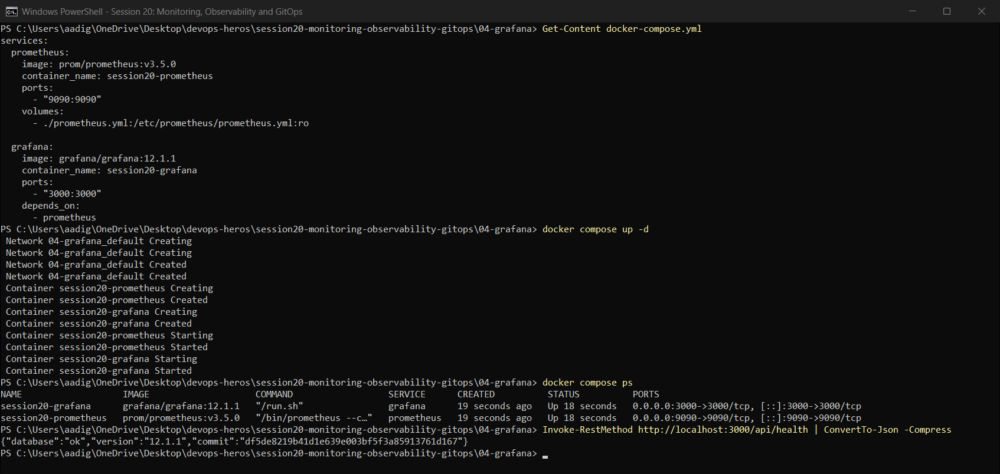

**04-grafana/02-datasource**

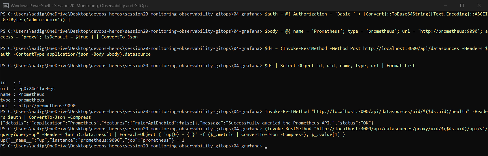

**04-grafana/03-dashboard**

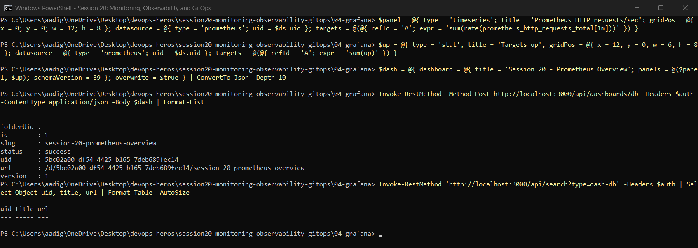

**04-grafana/04-stop**

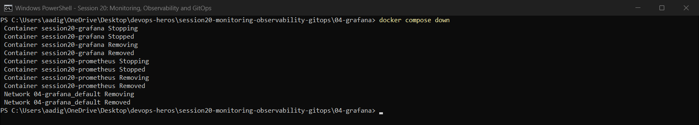


## 05 Introduction to GitOps

`kubectl apply -f app/` is the traditional **push** model. A manual `kubectl scale --replicas=4` then shows **drift**: the cluster no longer matches the files, and nothing corrects it. GitOps fixes this with a controller that keeps reconciling the cluster to what Git says.

**05-introduction-to-gitops/01-push-model**

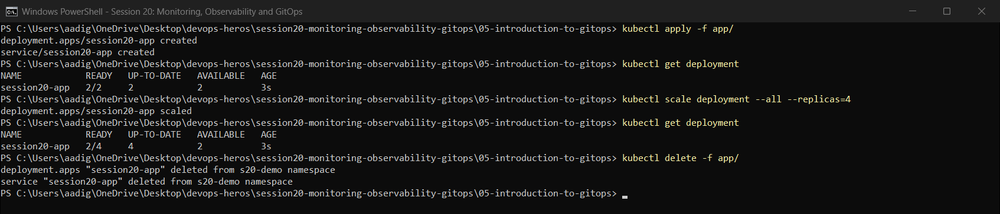


## 06 Git as source of truth

In a copy of `gitops-repo/`:
1. `git init`, then commit `Add session 20 application manifests`.
2. Change `replicas: 2 → 3` and check it with `git diff`.
3. Commit `Scale application to three replicas`; `git log --oneline` shows the history of the desired state.

**06-git-as-source-of-truth/01-repo**

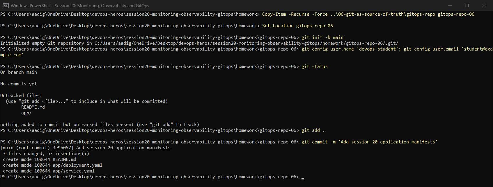

**06-git-as-source-of-truth/02-change-desired-state**

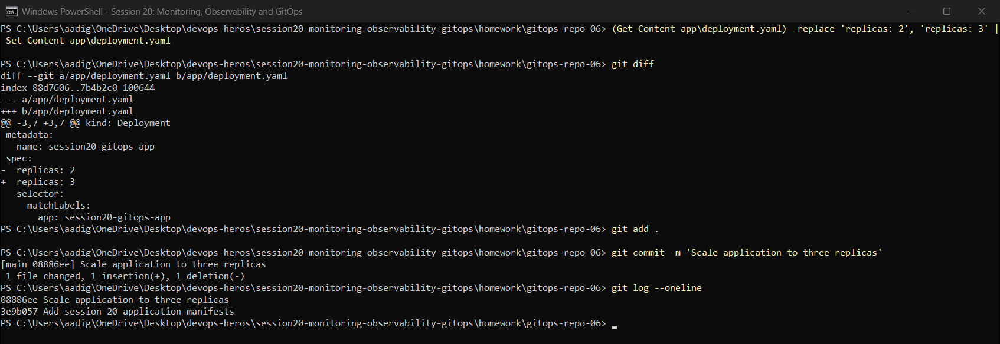


## 07 Argo CD

```powershell
kubectl create namespace argocd
kubectl apply -n argocd --server-side --force-conflicts -f https://raw.githubusercontent.com/argoproj/argo-cd/stable/manifests/install.yaml
kubectl get pods -n argocd
```

- Admin password: decoded from `argocd-initial-admin-secret` (the PowerShell equivalent of `base64 -d`). Logging in through `POST /api/v1/session` on the port-forwarded server returned a JWT.
- `kubectl apply -f app/argocd-application.yaml` made `session20-app` **Synced / Healthy** from `github.com/Nency-Ravaliya/gitops-demo` (path `app`). Its pods run in namespace `session20`.
- `kubectl port-forward svc/session20-gitops-app -n session20 9090:80` serves the nginx welcome page.

**07-argocd/01-install**

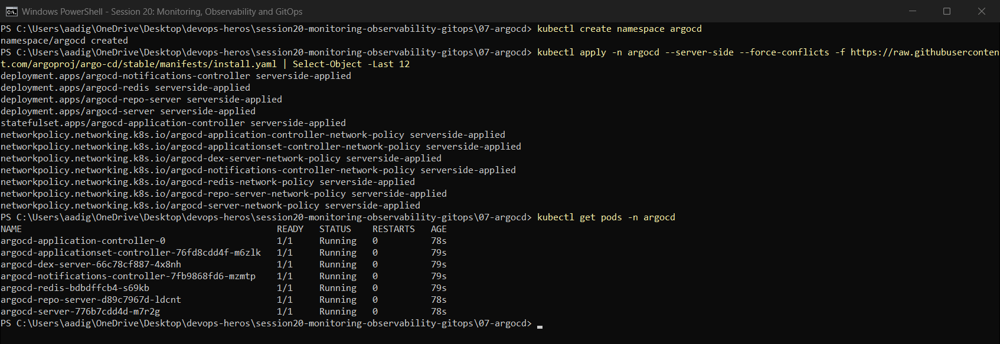

**07-argocd/02-login**

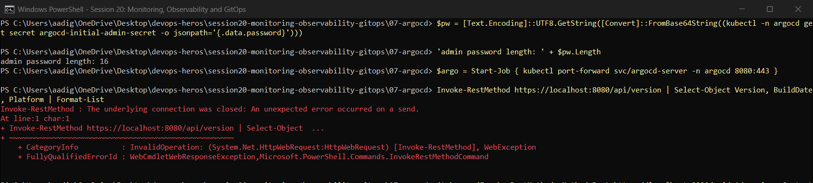

**07-argocd/03-application**

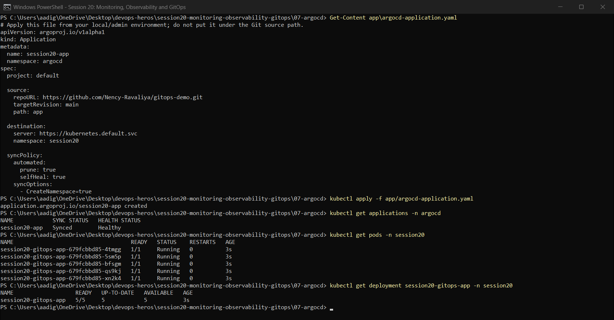

**07-argocd/04-open-app**

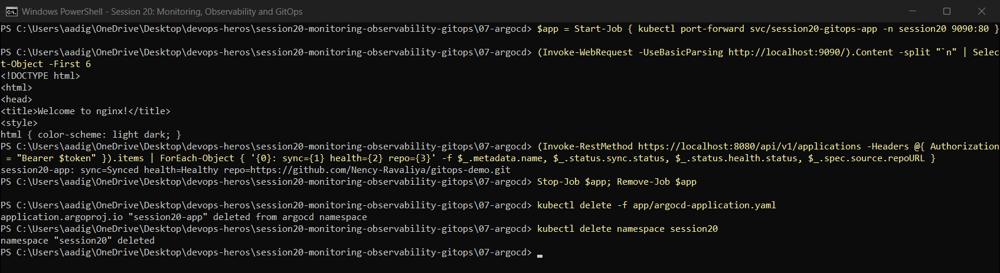


## 08 Mini project

**Requirements:** a Namespace, a Deployment (2 replicas), a Service and an Argo CD Application.

| Step | What happened |
| :--- | :--- |
| Git server | `git-server` pod in namespace `gitserver` (bare repo `gitops.git`, `git daemon` on 9418) |
| Create repo | `homework/gitops-repo` with `app/namespace.yaml`, `deployment.yaml`, `service.yaml`; `git push -u origin main` → `* [new branch] main -> main` |
| Create Application | [argocd/session20-mini-application.yaml](argocd/session20-mini-application.yaml): the course file with `repoURL` changed from `YOUR_USERNAME/YOUR_GITOPS_REPO` to the in-cluster server. Result **Synced / Healthy**, `deployment.apps/session20-mini 2/2` |
| Git change | `replicas: 2 → 3`, commit, `git push` (`61019ad..980818d`). Argo CD synced revision `980818d`, so the Deployment went to **3/3** |
| Self-healing | `kubectl scale … --replicas=1` dropped the Deployment to 1/1. Within seconds Argo CD reverted it to **3/3**. Events show `Scaled down … from 3 to 1`, then `Scaled up … from 1 to 3` |
| Observe | nginx logs; 3 pods Running; application `Synced / Healthy` |

```text
Git (desired state: replicas 3)  ->  Argo CD (compare + reconcile)  ->  Kubernetes (actual state)
                    manual drift to 1 replica  ->  reverted to 3 by selfHeal
```

Notes on the Git server:
- Pushes use `git config sendpack.sideband false`. Without it, Git for Windows hangs when pushing to `git daemon`.
- My first attempt served the repo over plain HTTP. Argo CD failed with `failed to list refs: empty input`, because it needs the smart Git protocol, which the `git://` daemon provides.

**08-mini-project/01-git-server**

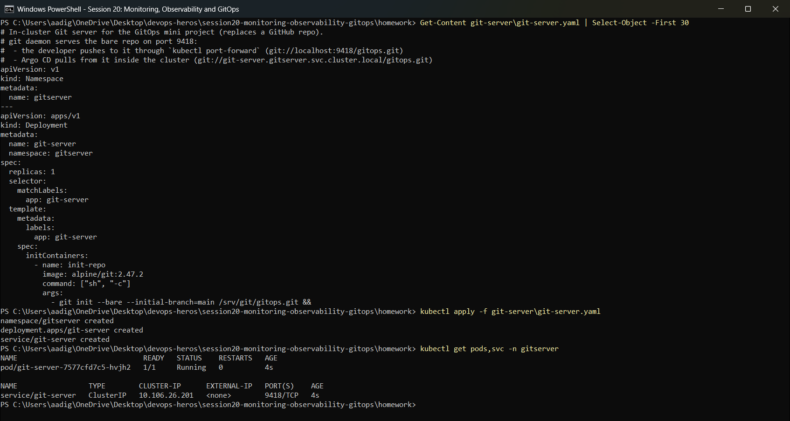

**08-mini-project/02-create-repo**

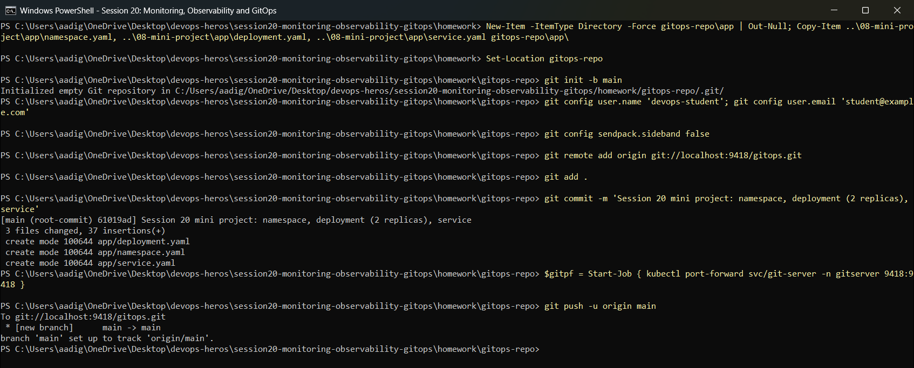

**08-mini-project/03-create-application**

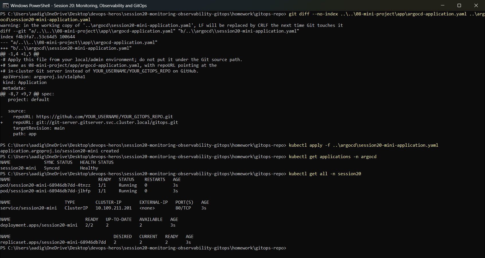

**08-mini-project/04-git-change**

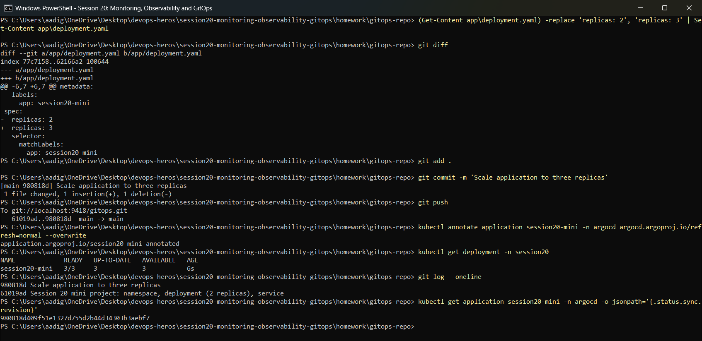

**08-mini-project/05-self-healing**

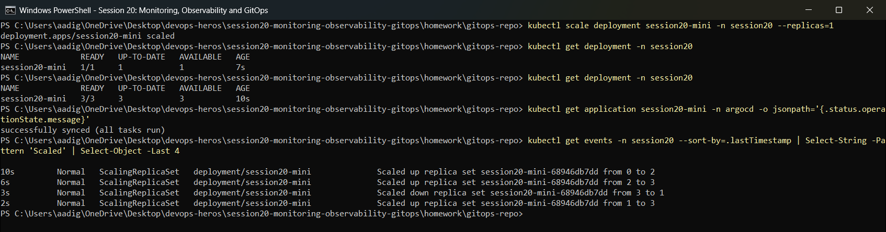

**08-mini-project/06-observe**

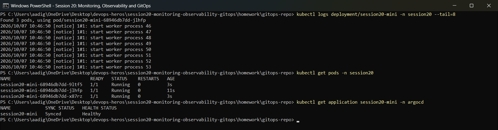


## Cleanup

Deleted both Argo CD applications and the `session20`, `gitserver`, `s20-demo` and `argocd` namespaces, and uninstalled Argo CD (CRDs and cluster roles included) with `kubectl delete -f install.yaml`. Both Docker Compose stacks were stopped with `docker compose down`. The local `.git` folders of the practice repos were removed and the kubectl namespace was set back to `default`.

**cleanup/01-cleanup**

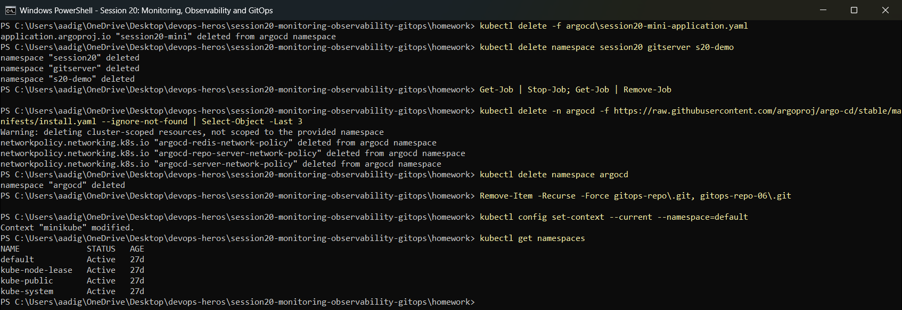


## Viva answers

- **Prometheus vs Grafana:** Prometheus scrapes and stores metrics and evaluates PromQL. Grafana visualises them; it stores no metrics itself.
- **Pull vs push deployment:** with push, CI runs `kubectl apply` and needs cluster credentials. With pull (GitOps), an in-cluster agent (Argo CD) pulls from Git, so no external system needs cluster access.
- **What does selfHeal do?** It reverts manual changes made in the cluster back to the Git state. `prune: true` deletes resources that were removed from Git.
- **How do you roll back in GitOps?** `git revert` the commit, and Argo CD syncs the previous state.
