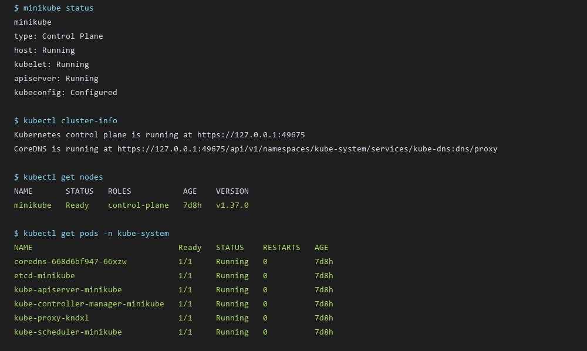

# Session 9: Kubernetes Fundamentals & Architecture

> **Homework Submission**: Session 9 Hands-on & Architecture Deep-Dive

---

## 1. Minikube Setup & Cluster Verification

Minikube is installed and active on the system. Below are the execution results of checking cluster status and system components.

### Cluster Status Output
```text
$ minikube status
minikube
type: Control Plane
host: Running
kubelet: Running
apiserver: Running
kubeconfig: Configured

$ kubectl cluster-info
Kubernetes control plane is running at https://127.0.0.1:49675
CoreDNS is running at https://127.0.0.1:49675/api/v1/namespaces/kube-system/services/kube-dns:dns/proxy

$ kubectl get nodes
NAME       STATUS   ROLES           AGE    VERSION
minikube   Ready    control-plane   7d8h   v1.37.0
```

### Terminal Output Screenshot


---

## 2. Docker Compose vs Kubernetes Connectivity

In Docker Compose applications, containers interact using Docker bridge networks:
- **Frontend to Backend**: The frontend container accesses the backend service using the container name/service alias defined in `docker-compose.yml` (e.g. `http://backend:5000`).
- **Backend to Database**: The backend connects to the database via its service name (e.g. `postgres:5432` or `mongodb:27017`).
- **Internal Verification**: Executing `docker exec -it <frontend-container> ping backend` or `curl http://backend:5000/api` verifies internal network reachability.

In Kubernetes, this multi-container network isolation and discovery is natively managed using **Services** and **CoreDNS** instead of Docker network aliases.

---

## 3. Kubernetes Architecture Deep-Dive

Kubernetes operates on a master-worker (Control Plane - Node) architecture:

```text
+-----------------------------------------------------------------------+
|                            CONTROL PLANE                              |
|                                                                       |
|   +-------------------+     +------------------+     +------------+   |
|   |  kube-apiserver   | <-> |       etcd       | <-> | scheduler  |   |
|   +-------------------+     +------------------+     +------------+   |
|             ^                                              ^          |
|             |               +------------------+           |          |
|             +-------------> |controller-manager| ----------+          |
|                             +------------------+                      |
+-----------------------------------|-----------------------------------+
                                    |
                                    v
+-----------------------------------------------------------------------+
|                             WORKER NODE                               |
|                                                                       |
|   +-------------------+     +------------------+     +------------+   |
|   |      kubelet      | <-> |    kube-proxy    | <-> |  Container |   |
|   |                   |     | (iptables/IPVS)  |     |  Runtime   |   |
|   +-------------------+     +------------------+     +------------+   |
+-----------------------------------------------------------------------+
```

### Control Plane Components

1. **`kube-apiserver`**:
   - The central front door of the Kubernetes control plane.
   - Exposes the Kubernetes API (RESTful endpoint).
   - Authenticates, authorizes, and validates all incoming requests (`kubectl`, UI, internal controllers).

2. **`etcd`**:
   - Consistent, fault-tolerant, distributed key-value database store.
   - Stores the complete cluster state, configuration, and secret data.
   - `kube-apiserver` is the **only** component that interacts directly with `etcd`.

3. **`kube-scheduler`**:
   - Watches for newly created Pods that have no Node assigned.
   - Evaluates resource requirements (CPU, memory), affinity/anti-affinity, taints/tolerations, and assigns the pod to the optimal worker node.

4. **`kube-controller-manager`**:
   - Runs background controller loops that regulate cluster state.
   - Examples include:
     - **Node Controller**: Monitors node health and responsiveness.
     - **ReplicaSet Controller**: Maintains the correct number of pod replicas.
     - **Endpoints Controller**: Populates Service Endpoints objects.

### Worker Node Components

1. **`kubelet`**:
   - The primary node agent running on every worker node.
   - Watches `kube-apiserver` for PodSpecs assigned to its node.
   - Communicates with the local container runtime via CRI (Container Runtime Interface) to start, monitor, and manage container health.

2. **`kube-proxy`**:
   - Network proxy that runs on each node in the cluster.
   - Reflects Kubernetes Networking services defined on `kube-apiserver`.
   - Manages packet filtering and NAT routing rules (`iptables` or `IPVS`) for pod-to-pod and service communication across the cluster.

3. **`Container Runtime`**:
   - The underlying software responsible for running containers (e.g. `containerd`, `CRI-O`, `Docker`).

---

## ⚡ 4. What Happens Under the Hood: `kubectl run` & `kubectl get pod`

### Scenario A: Executing `kubectl run nginx --image=nginx`
1. **CLI Authentication & Parsing**: `kubectl` parses the command, builds an HTTP POST request containing a PodSpec JSON payload, and sends it to `kube-apiserver`.
2. **Authentication & Authorization**: `kube-apiserver` verifies caller identity (certs/tokens) and permissions via RBAC (Role-Based Access Control).
3. **Admission Control & Validation**: Admission controllers validate the PodSpec (e.g. resource limits, security policies).
4. **ETCD Persistence**: `kube-apiserver` writes the new Pod object (Status: `Pending`, Node: `Unassigned`) into `etcd`.
5. **Scheduler Notification**: `kube-scheduler` detects an unscheduled Pod via an active API Server watch stream.
6. **Node Binding**: `kube-scheduler` runs scheduling algorithms (Filtering & Scoring) and binds the Pod to a Node (e.g., `minikube`). It updates `kube-apiserver`, which writes the binding to `etcd`.
7. **Kubelet Execution**: `kubelet` on the target node receives notification via watch stream. It invokes the Container Runtime (CRI) to pull the `nginx` image, create the network namespace (CNI), and launch the container.
8. **Status Update**: `kubelet` reports the Pod status (`Running`, Pod IP) back to `kube-apiserver`, which persists it to `etcd`.

### Scenario B: Executing `kubectl get pod`
1. `kubectl` sends an HTTP GET request (`/api/v1/namespaces/default/pods`) to `kube-apiserver`.
2. `kube-apiserver` authenticates the user request.
3. `kube-apiserver` queries `etcd` to fetch the current Pod objects for the namespace.
4. `kube-apiserver` formats the raw JSON metadata into tabular format and returns it to `kubectl` to display on the user's terminal.